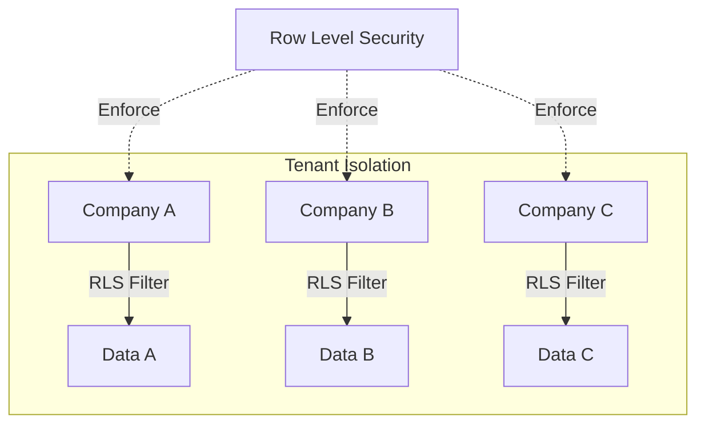
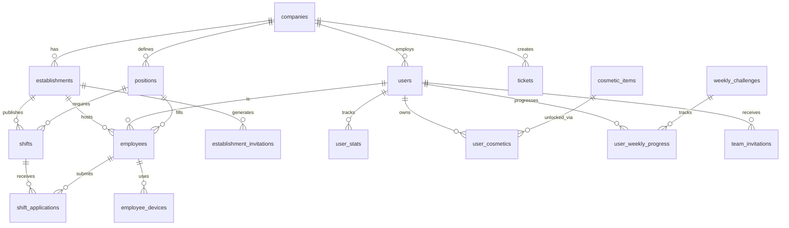

# Database Documentation - Shift Express

**Version**: 2.0.0
**Last updated**: 2025-10-17
**Schema**: PostgreSQL 15+ (Supabase)

---

## Table of Contents

- [Overview](#overview)
- [Complete Schema](#complete-schema)
- [Main Tables](#main-tables)
  - [Core Business](#core-business)
  - [Gamification System](#gamification-system)
  - [Invitation System](#invitation-system)
  - [Support & Audit](#support--audit)
- [Functions & Triggers](#functions--triggers)
- [Row Level Security (RLS)](#row-level-security-rls)
- [Indexes & Performance](#indexes--performance)
- [Enums](#enums)
- [Migrations](#migrations)

---

## Overview

### Multi-Tenant Architecture

The database uses an isolated multi-tenant architecture by `company_id` with Row Level Security (RLS) to ensure data isolation between client companies.



### Technologies

- **DBMS**: PostgreSQL 15+ (Supabase)
- **ORM**: Supabase JS Client (with auto-generated TypeScript types)
- **Authentication**: Supabase Auth (JWT + RLS)
- **Migrations**: Supabase CLI
- **Backup**: Daily automatic (Supabase)

### Current Statistics

- **Tables**: 27
- **Functions**: 41
- **Enums**: 8
- **Triggers**: 6
- **Cron Jobs**: 3

---

## Complete Schema

### Core Business Tables



---

## Main Tables

### Core Business

#### `companies`
Central table of the multi-tenant system. Each client company has an entry.

| Column | Type | Constraints | Default | Description |
|--------|------|-------------|---------|-------------|
| `id` | UUID | PK | gen_random_uuid() | Unique identifier |
| `name` | TEXT | NOT NULL | - | Company name |
| `logo_url` | TEXT | - | NULL | Logo URL |
| `subscription_plan` | ENUM | - | 'free' | Plan: free, pro, ultra, enterprise |
| `subscription_status` | ENUM | - | 'trialing' | active, trialing, past_due, canceled, incomplete |
| `subscription_interval` | TEXT | - | NULL | 'month' or 'year' |
| `stripe_customer_id` | TEXT | UNIQUE | NULL | Stripe customer ID |
| `stripe_subscription_id` | TEXT | UNIQUE | NULL | Stripe subscription ID |
| `subscription_current_period_end` | TIMESTAMPTZ | - | NULL | Current period end |
| `cancel_at_period_end` | BOOLEAN | - | false | Planned cancellation |
| `trial_ends_at` | TIMESTAMPTZ | - | NULL | Trial period end |
| `default_language` | ENUM | - | 'fr' | fr, en, es, it, zh |
| `created_at` | TIMESTAMPTZ | - | now() | Creation date |
| `updated_at` | TIMESTAMPTZ | - | now() | Last update |

**Associated functions**:
- `get_subscription_limits(plan)` - Returns max_establishments, max_shifts, etc.
- `delete_company(company_id)` - Secure deletion with cascade

**RLS Policies**:
- Admins see their own company only

---

#### `establishments`
Physical sites of companies (restaurants, hotels, stores, etc.)

| Column | Type | Constraints | Default | Description |
|--------|------|-------------|---------|-------------|
| `id` | UUID | PK | gen_random_uuid() | Unique identifier |
| `company_id` | UUID | FK NOT NULL | - | → companies(id) |
| `name` | TEXT | NOT NULL | - | Establishment name |
| `address` | TEXT | - | NULL | Full address |
| `city` | TEXT | - | NULL | City |
| `postal_code` | TEXT | - | NULL | Postal code |
| `status` | ENUM | - | 'active' | active, standby |
| `created_at` | TIMESTAMPTZ | - | now() | Creation date |
| `updated_at` | TIMESTAMPTZ | - | now() | Last update |

**Limits by plan**:
- Free: 1 establishment
- Pro: 3 establishments
- Ultra: 10 establishments
- Enterprise: Unlimited

**Triggers**:
- `check_establishment_limit` (BEFORE INSERT) - Validates plan limits

---

#### `positions`
Job positions available in establishments

| Column | Type | Constraints | Default | Description |
|--------|------|-------------|---------|-------------|
| `id` | UUID | PK | gen_random_uuid() | Unique identifier |
| `company_id` | UUID | FK NOT NULL | - | → companies(id) |
| `establishment_id` | UUID | FK | NULL | → establishments(id) |
| `title` | TEXT | NOT NULL | - | Position name (e.g., "Server", "Cook") |
| `description` | TEXT | - | NULL | Position description |
| `default_hourly_rate` | NUMERIC(10,2) | - | NULL | Default hourly rate (€) |
| `created_at` | TIMESTAMPTZ | - | now() | Creation date |
| `updated_at` | TIMESTAMPTZ | - | now() | Last update |

---

#### `users`
User profiles extending auth.users

| Column | Type | Constraints | Default | Description |
|--------|------|-------------|---------|-------------|
| `id` | UUID | PK | - | Matches auth.users(id) |
| `email` | TEXT | NOT NULL UNIQUE | - | Login email |
| `first_name` | TEXT | - | NULL | First name |
| `last_name` | TEXT | - | NULL | Last name |
| `phone` | TEXT | - | NULL | Phone |
| `role` | ENUM | NOT NULL | 'employee' | admin, manager, employee |
| `company_id` | UUID | FK | NULL | → companies(id) |
| `assigned_establishment_id` | UUID | FK | NULL | → establishments(id) |
| `points` | INTEGER | - | 0 | Total points (legacy, see user_stats) |
| `level` | INTEGER | - | 1 | Level (legacy, see user_stats) |
| `weekly_points` | INTEGER | - | 0 | Weekly points (legacy, see user_stats) |
| `created_at` | TIMESTAMPTZ | - | now() | Creation date |
| `updated_at` | TIMESTAMPTZ | - | now() | Last update |

**Note**: The points/level/weekly_points fields are duplicated in user_stats. Use user_stats as source of truth.

**Associated functions**:
- `signup_employer(email, password, company_name)` - Employer registration
- `complete_employer_signup(user_id, company_name)` - Finalize onboarding
- `can_access_establishment(user_id, establishment_id)` - Permission verification

**Triggers**:
- Auto-creation of user_stats on insert

---

#### `employees`
Employee profiles linked to establishments

| Column | Type | Constraints | Default | Description |
|--------|------|-------------|---------|-------------|
| `id` | UUID | PK | gen_random_uuid() | Unique identifier |
| `user_id` | UUID | FK NOT NULL UNIQUE | - | → users(id) |
| `company_id` | UUID | FK NOT NULL | - | → companies(id) |
| `establishment_id` | UUID | FK | NULL | → establishments(id) |
| `active` | BOOLEAN | - | true | Active employee |
| `hourly_rate` | NUMERIC(10,2) | - | NULL | Hourly rate (€) |
| `reliability_score` | NUMERIC(3,2) | - | 1.00 | Score 0.00-1.00 |
| `avg_response_time_seconds` | INTEGER | - | NULL | Average response time |
| `total_shifts_proposed` | INTEGER | - | 0 | Proposed shifts |
| `total_shifts_accepted` | INTEGER | - | 0 | Accepted shifts |
| `total_shifts_completed` | INTEGER | - | 0 | Completed shifts |
| `total_shifts_rejected` | INTEGER | - | 0 | Rejected shifts |
| `total_shifts_withdrawn` | INTEGER | - | 0 | Withdrawn shifts |
| `total_no_shows` | INTEGER | - | 0 | Unexcused absences |
| `created_at` | TIMESTAMPTZ | - | now() | Creation date |
| `updated_at` | TIMESTAMPTZ | - | now() | Last update |

**Constraints**:
- UNIQUE(user_id) - One user = 1 employee

**Associated functions**:
- `calculate_reliability_score(employee_id)` - Reliability score calculation
- `recalculate_all_reliability_scores()` - Batch recalculation

**Triggers**:
- Auto-update of stats on shift_application change

---

#### `shifts`
Shifts created by employers

| Column | Type | Constraints | Default | Description |
|--------|------|-------------|---------|-------------|
| `id` | UUID | PK | gen_random_uuid() | Unique identifier |
| `company_id` | UUID | FK NOT NULL | - | → companies(id) |
| `establishment_id` | UUID | FK NOT NULL | - | → establishments(id) |
| `position_id` | UUID | FK NOT NULL | - | → positions(id) |
| `start_time` | TIMESTAMPTZ | NOT NULL | - | Shift start |
| `end_time` | TIMESTAMPTZ | NOT NULL | - | Shift end |
| `break_duration_minutes` | INTEGER | - | 0 | Break (minutes) |
| `required_employees` | INTEGER | - | 1 | Number of required employees |
| `filled_employees` | INTEGER | - | 0 | Number of accepted employees |
| `status` | ENUM | - | 'pending' | pending, partially_filled, filled, completed, canceled, closed, expired |
| `description` | TEXT | - | NULL | Shift description |
| `published_at` | TIMESTAMPTZ | - | NULL | Publication date |
| `filled_at` | TIMESTAMPTZ | - | NULL | Full completion date |
| `created_at` | TIMESTAMPTZ | - | now() | Creation date |
| `updated_at` | TIMESTAMPTZ | - | now() | Last update |

**Limits by plan**:
- Free: 1 active shift max
- Pro+: Unlimited

**Indexes**:
- `idx_shifts_company_status` on (company_id, status)
- `idx_shifts_establishment` on (establishment_id)
- `idx_shifts_start_time` on (start_time) WHERE status IN ('open', 'partially_filled')

**Associated functions**:
- `auto_complete_shifts()` - Daily cron to mark past shifts as completed
- `expire_old_shifts()` - Daily cron to expire unfilled shifts

**Triggers**:
- `check_shift_limit` (BEFORE INSERT) - Validates plan limits

---

#### `shift_applications`
Employee applications to shifts

| Column | Type | Constraints | Default | Description |
|--------|------|-------------|---------|-------------|
| `id` | UUID | PK | gen_random_uuid() | Unique identifier |
| `shift_id` | UUID | FK NOT NULL | - | → shifts(id) |
| `user_id` | UUID | FK NOT NULL | - | → users(id) |
| `status` | ENUM | - | 'pending' | pending, accepted, rejected, applied, withdrawn |
| `message` | TEXT | - | NULL | Application message |
| `response_time_seconds` | INTEGER | - | NULL | Response time (seconds) |
| `no_show` | BOOLEAN | - | false | Unexcused absence |
| `no_show_reported_by` | UUID | FK | NULL | → users(id) |
| `no_show_reported_at` | TIMESTAMPTZ | - | NULL | Report date |
| `reviewed_by` | UUID | FK | NULL | → users(id) |
| `reviewed_at` | TIMESTAMPTZ | - | NULL | Review date |
| `viewed_at` | TIMESTAMPTZ | - | NULL | View date |
| `applied_at` | TIMESTAMPTZ | - | now() | Application date |

**Constraints**:
- UNIQUE(shift_id, user_id) - 1 application per shift

**Indexes**:
- `idx_applications_shift_user` on (shift_id, user_id)
- `idx_applications_status` on (status) WHERE status = 'pending'
- `idx_applications_user_status` on (user_id, status)

**RLS Policies** (Fixed in migration 20251012192924):
- `users_select_own_applications` - Users see their applications
- `users_insert_own_applications` - Users create their applications
- `users_update_own_applications` - Users update their applications
- `users_delete_own_applications` - Users delete their applications
- `employers_view_company_applications` - Employers see their company applications
- `employers_update_company_applications` - Employers update their company applications

**Triggers**:
- `trigger_notify_new_shift` (AFTER INSERT) - Sends push notification

---

### Gamification System

#### `user_stats`
User statistics and progression

| Column | Type | Constraints | Default | Description |
|--------|------|-------------|---------|-------------|
| `user_id` | UUID | PK FK | - | → users(id) |
| `total_points` | INTEGER | - | 0 | Total accumulated points |
| `weekly_points` | INTEGER | - | 0 | Weekly points |
| `current_streak_days` | INTEGER | - | 0 | Consecutive days streak |
| `best_streak_days` | INTEGER | - | 0 | Best streak |
| `last_login_date` | DATE | - | NULL | Last login |
| `total_shifts_accepted` | INTEGER | - | 0 | Accepted shifts |
| `total_shifts_completed` | INTEGER | - | 0 | Completed shifts |
| `total_shifts_cancelled` | INTEGER | - | 0 | Cancelled shifts |
| `total_shifts_offered` | INTEGER | - | 0 | Offered shifts |
| `responses_under_2min` | INTEGER | - | 0 | Responses < 2min |
| `responses_2_to_5min` | INTEGER | - | 0 | Responses 2-5min |
| `avg_response_time_minutes` | NUMERIC(10,2) | - | NULL | Average response time |
| `morning_shifts_accepted` | INTEGER | - | 0 | Morning shifts accepted (5am-12pm) |
| `night_shifts_accepted` | INTEGER | - | 0 | Night shifts accepted (8pm-5am) |
| `weekend_shifts_completed` | INTEGER | - | 0 | Weekend shifts completed |
| `no_cancellation_streak` | INTEGER | - | 0 | Streak without cancellation |
| `first_responder_count` | INTEGER | - | 0 | Times being first to respond |
| `week_start_date` | DATE | - | current week | Current week start |
| `last_reset_at` | TIMESTAMPTZ | - | NULL | Last weekly reset |
| `equipped_avatar_id` | UUID | FK | NULL | → cosmetic_items(id) |
| `equipped_title_id` | UUID | FK | NULL | → cosmetic_items(id) |
| `equipped_badge_id` | UUID | FK | NULL | → cosmetic_items(id) |
| `equipped_frame_id` | UUID | FK | NULL | → cosmetic_items(id) |
| `equipped_color_id` | UUID | FK | NULL | → cosmetic_items(id) |
| `created_at` | TIMESTAMPTZ | - | now() | Creation date |
| `updated_at` | TIMESTAMPTZ | - | now() | Last update |

**Indexes**:
- `idx_user_stats_weekly_points` on (weekly_points DESC) - Weekly leaderboard
- `idx_user_stats_total_points` on (total_points DESC) - Total leaderboard

**Associated functions**:
- `increment_user_points(user_id, points)` - Add points
- `increment_user_stat(user_id, stat_name, increment)` - Increment specific stat
- `reset_user_stat(user_id, stat_name)` - Reset stat
- `add_xp_to_user(user_id, amount, reason)` - Add XP with reason

**Triggers**:
- Automatic weekly reset (cron: Mondays 00:00 UTC)

---

#### `cosmetic_items`
Catalog of unlockable cosmetic items

| Column | Type | Constraints | Default | Description |
|--------|------|-------------|---------|-------------|
| `id` | UUID | PK | gen_random_uuid() | Unique identifier |
| `type` | TEXT | NOT NULL | - | avatar, frame, badge, title, color |
| `name` | TEXT | NOT NULL | - | Item name |
| `description` | TEXT | - | NULL | Description |
| `rarity` | TEXT | NOT NULL | 'common' | common, rare, epic, legendary |
| `preview_url` | TEXT | - | NULL | URL or gradient:#hex,#hex,... |
| `points_cost` | INTEGER | NOT NULL | 0 | Points cost (0 = gift) |
| `unlock_requirement` | JSONB | - | NULL | Unlock conditions |
| `is_active` | BOOLEAN | - | true | Item available |
| `sort_order` | INTEGER | - | 0 | Display order |
| `created_at` | TIMESTAMPTZ | - | now() | Creation date |
| `updated_at` | TIMESTAMPTZ | - | now() | Last update |

**Types**: avatar | frame | badge | title | color

**Rarities and Typical Costs**:
- `common`: Free (starter items)
- `rare`: 500-700 points
- `epic`: 1500-3500 points
- `legendary`: 7000-15000 points

**Preview URL Format**:
- Images: Standard URL (https://...)
- Gradients: `gradient:#ec4899,#8b5cf6,#3b82f6`

**Seeding**: 61 pre-created items in migrations

---

#### `user_cosmetics`
Inventory of cosmetics unlocked by user

| Column | Type | Constraints | Default | Description |
|--------|------|-------------|---------|-------------|
| `id` | UUID | PK | gen_random_uuid() | Unique identifier |
| `user_id` | UUID | FK NOT NULL | - | → users(id) |
| `cosmetic_item_id` | UUID | FK NOT NULL | - | → cosmetic_items(id) |
| `is_equipped` | BOOLEAN | - | false | Item equipped |
| `unlocked_at` | TIMESTAMPTZ | - | now() | Unlock date |
| `created_at` | TIMESTAMPTZ | - | now() | Creation date |

**Constraints**:
- UNIQUE(user_id, cosmetic_item_id)

**Indexes**:
- `idx_user_cosmetics_user` on (user_id)

**Associated functions**:
- `unlock_badge_for_user(user_id, badge_id)` - Unlock cosmetic

---

#### `weekly_challenges`
Weekly challenges for employees

| Column | Type | Constraints | Default | Description |
|--------|------|-------------|---------|-------------|
| `id` | UUID | PK | gen_random_uuid() | Unique identifier |
| `challenge_key` | TEXT | NOT NULL UNIQUE | - | Technical challenge key |
| `name` | TEXT | NOT NULL | - | Challenge name |
| `description` | TEXT | NOT NULL | - | Description |
| `points_reward` | INTEGER | NOT NULL | - | Points to earn |
| `target_count` | INTEGER | - | 1 | Target to reach |
| `icon` | TEXT | - | NULL | Icon (emoji or URL) |
| `is_active` | BOOLEAN | - | true | Active challenge |
| `sort_order` | INTEGER | - | 0 | Display order |
| `created_at` | TIMESTAMPTZ | - | now() | Creation date |
| `updated_at` | TIMESTAMPTZ | - | now() | Last update |

**Active Challenges** (7 pre-seeded):
1. `accept_3_shifts` - Accept 3 shifts (100 pts, target: 3)
2. `complete_5_shifts` - Complete 5 shifts (200 pts, target: 5)
3. `fast_responder` - 3 responses < 2min (150 pts, target: 3)
4. `weekend_warrior` - 2 weekend shifts (150 pts, target: 2)
5. `morning_person` - 3 morning shifts (120 pts, target: 3)
6. `night_owl` - 2 night shifts (120 pts, target: 2)
7. `perfect_week` - No cancellation (250 pts, target: 1)

---

#### `user_weekly_progress`
Weekly user progress on challenges

| Column | Type | Constraints | Default | Description |
|--------|------|-------------|---------|-------------|
| `id` | UUID | PK | gen_random_uuid() | Unique identifier |
| `user_id` | UUID | FK NOT NULL | - | → users(id) |
| `challenge_id` | UUID | FK NOT NULL | - | → weekly_challenges(id) |
| `week_start_date` | DATE | NOT NULL | - | Week start |
| `current_count` | INTEGER | - | 0 | Current progress |
| `completed` | BOOLEAN | - | false | Challenge completed |
| `claimed` | BOOLEAN | - | false | Reward claimed |
| `completed_at` | TIMESTAMPTZ | - | NULL | Completion date |
| `claimed_at` | TIMESTAMPTZ | - | NULL | Claim date |
| `created_at` | TIMESTAMPTZ | - | now() | Creation date |
| `updated_at` | TIMESTAMPTZ | - | now() | Last update |

**Constraints**:
- UNIQUE(user_id, challenge_id, week_start_date)

**Indexes**:
- `idx_user_progress_user_week` on (user_id, week_start_date)

**Associated functions** (Fixed in migration 20251012201326):
- `increment_challenge_progress(user_id, challenge_id, increment, week_start)` - Increment progress
- `claim_challenge_reward(user_id, challenge_id, week_start)` - Claim reward with rate limiting

---

#### `challenges` (Legacy)
Old generic challenges system (replaced by weekly_challenges)

| Column | Type | Constraints | Default | Description |
|--------|------|-------------|---------|-------------|
| `id` | UUID | PK | gen_random_uuid() | Unique identifier |
| `name` | TEXT | NOT NULL | - | Challenge name |
| `description` | TEXT | - | NULL | Description |
| `points_reward` | INTEGER | NOT NULL | - | Reward points |
| `target_value` | INTEGER | - | NULL | Target value |
| `active` | BOOLEAN | - | true | Active challenge |
| `created_at` | TIMESTAMPTZ | - | now() | Creation date |
| `updated_at` | TIMESTAMPTZ | - | now() | Last update |

**Status**: Legacy table kept for backward compatibility

---

#### `employee_challenges` (Legacy)
Old per-employee progression system (replaced by user_weekly_progress)

| Column | Type | Constraints | Default | Description |
|--------|------|-------------|---------|-------------|
| `id` | UUID | PK | gen_random_uuid() | Unique identifier |
| `employee_id` | UUID | FK | - | → employees(id) |
| `challenge_id` | UUID | FK | - | → challenges(id) |
| `progress` | INTEGER | - | 0 | Progress |
| `completed_at` | TIMESTAMPTZ | - | NULL | Completion date |

**Status**: Legacy table kept for migration

---

#### `rewards`
Catalog of redeemable rewards

| Column | Type | Constraints | Default | Description |
|--------|------|-------------|---------|-------------|
| `id` | UUID | PK | gen_random_uuid() | Unique identifier |
| `name` | TEXT | NOT NULL | - | Reward name |
| `description` | TEXT | - | NULL | Description |
| `type` | TEXT | NOT NULL | 'voucher' | voucher, physical, digital |
| `value` | NUMERIC(10,2) | NOT NULL | 0 | Value (€) |
| `points_required` | INTEGER | NOT NULL | - | Required points |
| `stock_quantity` | INTEGER | - | NULL | Available stock |
| `image_url` | TEXT | - | NULL | Reward image |
| `is_active` | BOOLEAN | - | true | Active reward |
| `created_at` | TIMESTAMPTZ | - | now() | Creation date |
| `updated_at` | TIMESTAMPTZ | - | now() | Last update |

---

#### `employee_rewards`
Reward redemption history

| Column | Type | Constraints | Default | Description |
|--------|------|-------------|---------|-------------|
| `id` | UUID | PK | gen_random_uuid() | Unique identifier |
| `employee_id` | UUID | FK NOT NULL | - | → employees(id) |
| `reward_id` | UUID | FK NOT NULL | - | → rewards(id) |
| `status` | TEXT | - | 'pending' | pending, issued, used, expired |
| `voucher_code` | TEXT | UNIQUE | NULL | Voucher code |
| `redeemed_at` | TIMESTAMPTZ | - | now() | Redemption date |
| `used_at` | TIMESTAMPTZ | - | NULL | Usage date |

---

### Invitation System

#### `establishment_invitations`
QR code / link-based employee recruitment

| Column | Type | Constraints | Default | Description |
|--------|------|-------------|---------|-------------|
| `id` | UUID | PK | gen_random_uuid() | Unique identifier |
| `company_id` | UUID | FK NOT NULL | - | → companies(id) |
| `establishment_id` | UUID | FK NOT NULL | - | → establishments(id) |
| `created_by` | UUID | FK NOT NULL | - | → users(id) |
| `token` | TEXT | NOT NULL UNIQUE | - | Invitation token |
| `description` | TEXT | - | NULL | Description |
| `max_uses` | INTEGER | - | NULL | Maximum uses |
| `current_uses` | INTEGER | - | 0 | Current uses |
| `expires_at` | TIMESTAMPTZ | - | NULL | Expiration date |
| `is_active` | BOOLEAN | - | true | Active invitation |
| `last_used_at` | TIMESTAMPTZ | - | NULL | Last use |
| `metadata` | JSONB | - | NULL | Additional metadata |
| `created_at` | TIMESTAMPTZ | - | now() | Creation date |

**Constraints**:
- UNIQUE(token)

**Associated functions**:
- `generate_invitation_token()` - Generate unique token
- `validate_invitation_token_readonly(token)` - Validate without side effects
- `validate_invitation_token(token, user_id, employee_id, ip, user_agent)` - Full validation
- `increment_invitation_uses(token)` - Increment counter

---

#### `establishment_invitation_signups`
Tracking of signups via invitations

| Column | Type | Constraints | Default | Description |
|--------|------|-------------|---------|-------------|
| `id` | UUID | PK | gen_random_uuid() | Unique identifier |
| `invitation_id` | UUID | FK NOT NULL | - | → establishment_invitations(id) |
| `user_id` | UUID | FK NOT NULL | - | → users(id) |
| `employee_id` | UUID | FK NOT NULL | - | → employees(id) |
| `ip_address` | INET | - | NULL | IP address |
| `user_agent` | TEXT | - | NULL | User agent |
| `metadata` | JSONB | - | NULL | Additional metadata |
| `signed_up_at` | TIMESTAMPTZ | - | now() | Signup date |

**Indexes**:
- Index on (invitation_id)
- Index on (user_id)

---

#### `team_invitations`
Invitations for managers/admins

| Column | Type | Constraints | Default | Description |
|--------|------|-------------|---------|-------------|
| `id` | UUID | PK | gen_random_uuid() | Unique identifier |
| `company_id` | UUID | FK NOT NULL | - | → companies(id) |
| `establishment_id` | UUID | FK | NULL | → establishments(id) |
| `created_by` | UUID | FK | NULL | → users(id) |
| `email` | TEXT | NOT NULL | - | Invitee email |
| `first_name` | TEXT | - | NULL | First name |
| `last_name` | TEXT | - | NULL | Last name |
| `role` | TEXT | - | NULL | admin, manager |
| `token` | TEXT | NOT NULL UNIQUE | - | Invitation token |
| `expires_at` | TIMESTAMPTZ | - | now() + 7 days | Expiration date |
| `accepted_at` | TIMESTAMPTZ | - | NULL | Acceptance date |
| `created_at` | TIMESTAMPTZ | - | now() | Creation date |
| `updated_at` | TIMESTAMPTZ | - | now() | Last update |

**Associated functions**:
- `accept_manager_invitation(token, first_name, last_name, password)` - Accept invitation
- `get_invitation_by_token(token)` - Get details

---

### Support & Audit

#### `tickets`
Customer support system

| Column | Type | Constraints | Default | Description |
|--------|------|-------------|---------|-------------|
| `id` | UUID | PK | gen_random_uuid() | Unique identifier |
| `company_id` | UUID | FK NOT NULL | - | → companies(id) |
| `user_id` | UUID | FK NOT NULL | - | → users(id) |
| `subject` | TEXT | NOT NULL | - | Ticket subject |
| `status` | ENUM | - | 'open' | open, in_progress, resolved, closed |
| `priority` | TEXT | - | 'normal' | low, normal, high, urgent |
| `created_at` | TIMESTAMPTZ | - | now() | Creation date |
| `updated_at` | TIMESTAMPTZ | - | now() | Last update |

---

#### `ticket_messages`
Ticket messages

| Column | Type | Constraints | Default | Description |
|--------|------|-------------|---------|-------------|
| `id` | UUID | PK | gen_random_uuid() | Unique identifier |
| `ticket_id` | UUID | FK NOT NULL | - | → tickets(id) |
| `user_id` | UUID | FK NOT NULL | - | → users(id) |
| `message` | TEXT | NOT NULL | - | Message content |
| `is_internal` | BOOLEAN | - | false | Internal note |
| `created_at` | TIMESTAMPTZ | - | now() | Creation date |

---

#### `audit_logs`
Security and compliance audit logs

| Column | Type | Constraints | Default | Description |
|--------|------|-------------|---------|-------------|
| `id` | UUID | PK | gen_random_uuid() | Unique identifier |
| `user_id` | UUID | FK | NULL | → users(id) |
| `user_email` | TEXT | - | NULL | User email |
| `event_type` | TEXT | NOT NULL | - | Event type |
| `path` | TEXT | NOT NULL | - | API path |
| `method` | TEXT | - | NULL | HTTP method |
| `ip_address` | TEXT | NOT NULL | - | IP address |
| `user_agent` | TEXT | - | NULL | User agent |
| `details` | JSONB | - | NULL | Additional details |
| `created_at` | TIMESTAMPTZ | NOT NULL | now() | Creation date |

**Indexes**:
- Index on (user_id, created_at)
- Index on (event_type, created_at)

**Associated functions**:
- `cleanup_old_audit_logs()` - Cron to clean old logs

---

#### `otp_codes`
OTP codes for passwordless authentication

| Column | Type | Constraints | Default | Description |
|--------|------|-------------|---------|-------------|
| `id` | UUID | PK | gen_random_uuid() | Unique identifier |
| `email` | TEXT | NOT NULL | - | User email |
| `code` | TEXT | NOT NULL | - | OTP code |
| `used` | BOOLEAN | - | false | Code used |
| `created_at` | TIMESTAMPTZ | NOT NULL | now() | Creation date |
| `expires_at` | TIMESTAMPTZ | NOT NULL | now() + 60 min | Expiration date |

**Indexes**:
- Index on (email, used, expires_at)

**Expiration**: 60 minutes

---

#### `employee_devices`
Push notification tokens

| Column | Type | Constraints | Default | Description |
|--------|------|-------------|---------|-------------|
| `id` | UUID | PK | gen_random_uuid() | Unique identifier |
| `employee_id` | UUID | FK NOT NULL | - | → employees(id) |
| `push_token` | TEXT | NOT NULL UNIQUE | - | Expo Push token |
| `platform` | TEXT | - | NULL | ios, android |
| `created_at` | TIMESTAMPTZ | - | now() | Creation date |
| `updated_at` | TIMESTAMPTZ | - | now() | Last update |

**Constraints**:
- UNIQUE(push_token)

**Indexes**:
- Index on (employee_id)

---

#### `admin_whitelist`
Platform administrator access control

| Column | Type | Constraints | Default | Description |
|--------|------|-------------|---------|-------------|
| `id` | UUID | PK | gen_random_uuid() | Unique identifier |
| `email` | TEXT | NOT NULL UNIQUE | - | Admin email |
| `role` | TEXT | - | NULL | Specific role |
| `is_active` | BOOLEAN | - | true | Active |
| `created_at` | TIMESTAMPTZ | - | now() | Creation date |
| `updated_at` | TIMESTAMPTZ | - | now() | Last update |

---

#### `user_roles`
User role assignment

| Column | Type | Constraints | Default | Description |
|--------|------|-------------|---------|-------------|
| `user_id` | UUID | PK FK | - | → users(id) |
| `company_id` | UUID | FK | NULL | → companies(id) |
| `assigned_establishment_id` | UUID | FK | NULL | → establishments(id) |
| `role` | TEXT | NOT NULL | - | admin, manager, employee |
| `created_at` | TIMESTAMPTZ | - | now() | Creation date |
| `updated_at` | TIMESTAMPTZ | - | now() | Last update |

---

#### `user_permissions`
Granular permissions system

| Column | Type | Constraints | Default | Description |
|--------|------|-------------|---------|-------------|
| `id` | UUID | PK | gen_random_uuid() | Unique identifier |
| `user_id` | UUID | FK NOT NULL | - | → users(id) |
| `permission` | TEXT | NOT NULL | - | Permission |
| `resource_type` | TEXT | - | NULL | Resource type |
| `resource_id` | UUID | - | NULL | Resource ID |
| `created_at` | TIMESTAMPTZ | - | now() | Creation date |

---

## Functions & Triggers

### Gamification Functions

#### `increment_user_points(user_id UUID, points INTEGER)`
Adds points to a user and checks for badge unlocks

```sql
SELECT increment_user_points('user-uuid', 100);
```

**Functionality**:
- Increments total_points and weekly_points
- Automatically calls `check_and_unlock_badges()`
- Updates updated_at

---

#### `increment_user_stat(user_id UUID, stat_name TEXT, increment INTEGER)`
Increments a specific statistic

```sql
SELECT increment_user_stat('user-uuid', 'responses_under_2min', 1);
```

**Available stats**: All INTEGER columns from user_stats

---

#### `increment_challenge_progress(user_id UUID, challenge_id UUID, increment INTEGER, week_start DATE)`
Increments weekly challenge progress

```sql
SELECT increment_challenge_progress(
  'user-uuid',
  'challenge-uuid',
  1,
  '2025-10-13'::date
);
```

**Functionality**:
- Upsert on user_weekly_progress
- Automatically marks as completed if target reached
- Safe for multiple calls (idempotent)

---

#### `claim_challenge_reward(user_id UUID, challenge_id UUID, week_start DATE)`
Claims a completed challenge reward (with rate limiting)

```sql
SELECT claim_challenge_reward(
  'user-uuid',
  'challenge-uuid',
  '2025-10-13'::date
);
```

**Return**: JSON with `success`, `points_awarded`, or `error`

**Security**:
- Verifies challenge is completed
- Verifies reward hasn't already been claimed
- Rate limiting to prevent double claims

**Fixed in**: Migration 20251012201326

---

#### `check_and_unlock_badges(user_id UUID)`
Checks and automatically unlocks badges matching achievements

```sql
SELECT check_and_unlock_badges('user-uuid');
```

**Auto-Unlock Badges**:
- Weekend Warrior (2 weekend shifts completed)
- Lightning Speed (3 responses < 2min)
- Other badges based on unlock_requirement (JSONB)

---

#### `unlock_badge_for_user(user_id UUID, badge_id UUID)`
Manually unlocks a cosmetic

```sql
SELECT unlock_badge_for_user('user-uuid', 'badge-uuid');
```

**Constraints**:
- Ignores if already unlocked (UNIQUE)
- SECURITY DEFINER with validation

---

#### `add_xp_to_user(user_id UUID, amount INTEGER, reason TEXT)`
Adds XP with reason tracking

```sql
SELECT add_xp_to_user('user-uuid', 50, 'Shift completed on time');
```

**Return**: JSON with new total

---

### Management Functions

#### `calculate_reliability_score(employee_id UUID)`
Calculates reliability score (0.00-1.00)

```sql
SELECT calculate_reliability_score('employee-uuid');
```

**Calculation**:
- Base: 1.00
- -15% per no-show
- -5% per cancellation
- Min: 0.00, Max: 1.00

---

#### `recalculate_all_reliability_scores()`
Recalculates all reliability scores (batch)

```sql
SELECT recalculate_all_reliability_scores();
```

**Usage**: Weekly cron or manual admin

---

#### `get_subscription_limits(plan TEXT)`
Returns subscription plan limits

```sql
SELECT get_subscription_limits('pro');
```

**Return**:
```json
{
  "max_establishments": 3,
  "max_shifts_active": null,
  "max_employees": null
}
```

---

#### `can_access_establishment(user_id UUID, establishment_id UUID)`
Checks if a user can access an establishment

```sql
SELECT can_access_establishment('user-uuid', 'establishment-uuid');
```

**Return**: BOOLEAN

**Logic**:
- Admin: all establishments of their company
- Manager: only their assigned_establishment_id
- Employee: all establishments of their company

---

### Authentication Functions

#### `signup_employer(email TEXT, password TEXT, company_name TEXT)`
Registers a new employer

```sql
SELECT signup_employer(
  'boss@example.com',
  'securepassword',
  'My Restaurant'
);
```

**Return**: JSON with `user_id`, `company_id`

**Actions**:
1. Creates user in auth.users
2. Creates company
3. Creates user_stats
4. Assigns 'admin' role

---

#### `complete_employer_signup(user_id UUID, company_name TEXT)`
Finalizes employer onboarding

```sql
SELECT complete_employer_signup('user-uuid', 'My Company');
```

**Usage**: After email verification

---

### Invitation Functions

#### `generate_invitation_token()`
Generates a unique invitation token

```sql
SELECT generate_invitation_token();
```

**Return**: TEXT (32 alphanumeric characters)

---

#### `validate_invitation_token_readonly(token TEXT)`
Validates a token without side effects

```sql
SELECT validate_invitation_token_readonly('abc123xyz');
```

**Return**: JSON with invitation details or error

**Usage**: Invitation page display

---

#### `validate_invitation_token(token TEXT, user_id UUID, employee_id UUID, ip_address INET, user_agent TEXT)`
Full validation with tracking

```sql
SELECT validate_invitation_token(
  'abc123xyz',
  'user-uuid',
  'employee-uuid',
  '192.168.1.1',
  'Mozilla/5.0...'
);
```

**Actions**:
1. Validates token (exists, active, not expired, max_uses)
2. Creates entry in establishment_invitation_signups
3. Increments current_uses
4. Updates last_used_at

---

#### `accept_manager_invitation(token TEXT, first_name TEXT, last_name TEXT, password TEXT)`
Accepts a manager invitation

```sql
SELECT accept_manager_invitation(
  'token123',
  'John',
  'Doe',
  'securepassword'
);
```

**Return**: JSON with `user_id`, `company_id`, `establishment_id`

---

### Maintenance Functions

#### `auto_complete_shifts()`
Marks past shifts as completed

```sql
SELECT auto_complete_shifts();
```

**Cron**: Daily at 01:00 UTC

**Logic**:
- end_time < NOW()
- status = 'filled'
- → status = 'completed'

---

#### `expire_old_shifts()`
Expires old unfilled shifts

```sql
SELECT expire_old_shifts();
```

**Cron**: Daily at 02:00 UTC

**Logic**:
- start_time < NOW() - 24h
- status IN ('pending', 'partially_filled')
- → status = 'expired'

---

#### `cleanup_old_audit_logs()`
Cleans up old audit logs

```sql
SELECT cleanup_old_audit_logs();
```

**Cron**: Daily at 03:00 UTC

**Logic**: DELETE logs > 90 days

---

### Triggers

#### `initialize_user_stats()`
**Event**: AFTER INSERT ON users
**Action**: Automatically creates user_stats with default values

---

#### `trigger_notify_new_shift()`
**Event**: AFTER INSERT ON shift_applications
**Action**: Sends push notification to manager (Migration 20251013000000)

---

#### `check_establishment_limit()`
**Event**: BEFORE INSERT ON establishments
**Action**: Validates that company doesn't exceed plan limit

---

#### `check_shift_limit()`
**Event**: BEFORE INSERT ON shifts
**Action**: Validates that company doesn't exceed max_shifts_active (Free: 1)

---

## Row Level Security (RLS)

### Principle

Each table uses RLS to isolate data by `company_id` and `role`.

### Roles

| Role | Description | Access |
|------|-------------|--------|
| `employee` | Standard employee | Own data + company shifts |
| `manager` | Establishment manager | Establishment data |
| `admin` | Company admin | All company data |
| `superadmin` | Platform super admin | Global access (debug only) |

### Critical Policies

#### `companies`
```sql
-- Admins see their company
CREATE POLICY "Admins can view own company"
ON companies FOR SELECT
TO authenticated
USING (
  id = (SELECT company_id FROM users WHERE id = auth.uid())
  AND (SELECT role FROM users WHERE id = auth.uid()) = 'admin'
);
```

---

#### `establishments`
```sql
-- Managers see their establishment
CREATE POLICY "Managers can view own establishment"
ON establishments FOR SELECT
TO authenticated
USING (
  company_id = (SELECT company_id FROM users WHERE id = auth.uid())
  AND (
    (SELECT role FROM users WHERE id = auth.uid()) = 'admin'
    OR id = (SELECT assigned_establishment_id FROM users WHERE id = auth.uid())
  )
);
```

---

#### `shifts`
```sql
-- Employees see company shifts
CREATE POLICY "Employees can view shifts"
ON shifts FOR SELECT
TO authenticated
USING (
  company_id = (SELECT company_id FROM users WHERE id = auth.uid())
);

-- Managers create shifts for their establishment
CREATE POLICY "Managers can create shifts"
ON shifts FOR INSERT
TO authenticated
WITH CHECK (
  establishment_id IN (
    SELECT id FROM establishments
    WHERE company_id = (SELECT company_id FROM users WHERE id = auth.uid())
  )
  AND (SELECT role FROM users WHERE id = auth.uid()) IN ('manager', 'admin')
);
```

---

#### `shift_applications`
```sql
-- Users see their own applications
CREATE POLICY "users_select_own_applications"
ON shift_applications FOR SELECT
TO authenticated
USING (user_id = auth.uid());

-- Employers see their company applications
CREATE POLICY "employers_view_company_applications"
ON shift_applications FOR SELECT
TO authenticated
USING (
  shift_id IN (
    SELECT id FROM shifts
    WHERE company_id = (SELECT company_id FROM users WHERE id = auth.uid())
  )
  AND (SELECT role FROM users WHERE id = auth.uid()) IN ('manager', 'admin')
);
```

**Fixed in**: Migration 20251012192924 (infinite recursion resolution)

---

#### `user_stats`
```sql
-- Users see their own stats
CREATE POLICY "Users can view own stats"
ON user_stats FOR SELECT
TO authenticated
USING (user_id = auth.uid());

-- Admins see their company stats
CREATE POLICY "Admins can view company stats"
ON user_stats FOR SELECT
TO authenticated
USING (
  user_id IN (
    SELECT id FROM users
    WHERE company_id = (SELECT company_id FROM users WHERE id = auth.uid())
  )
  AND (SELECT role FROM users WHERE id = auth.uid()) = 'admin'
);
```

**Note**: Leaderboard uses a materialized view without strict RLS (anonymized)

---

## Indexes & Performance

### Critical Indexes

```sql
-- Applications (fast search)
CREATE INDEX idx_applications_shift_user
  ON shift_applications(shift_id, user_id);

CREATE INDEX idx_applications_status
  ON shift_applications(status)
  WHERE status = 'pending';

CREATE INDEX idx_applications_user_status
  ON shift_applications(user_id, status);

-- User Stats (leaderboard)
CREATE INDEX idx_user_stats_weekly_points
  ON user_stats(weekly_points DESC);

CREATE INDEX idx_user_stats_total_points
  ON user_stats(total_points DESC);

-- Shifts (frequent filters)
CREATE INDEX idx_shifts_company_status
  ON shifts(company_id, status);

CREATE INDEX idx_shifts_establishment
  ON shifts(establishment_id);

CREATE INDEX idx_shifts_start_time
  ON shifts(start_time)
  WHERE status IN ('open', 'partially_filled');

-- User Cosmetics (inventory)
CREATE INDEX idx_user_cosmetics_user
  ON user_cosmetics(user_id);

-- Weekly Progress (challenges)
CREATE INDEX idx_user_progress_user_week
  ON user_weekly_progress(user_id, week_start_date);
```

### Optimizations

- **Connection Pooling**: Supabase Pooler (transaction mode)
- **Caching**: Redis for leaderboard (TTL: 5min)
- **Partitioning**: audit_logs by month (if > 10M rows)
- **Materialized Views**: Pre-calculated leaderboard (refresh 5min)

---

## Enums

### `application_status`
```sql
'pending' | 'accepted' | 'rejected' | 'applied' | 'withdrawn'
```

### `establishment_status`
```sql
'active' | 'standby'
```

### `language_code`
```sql
'fr' | 'en' | 'es' | 'it' | 'zh'
```

### `shift_status`
```sql
'pending' | 'partially_filled' | 'filled' | 'completed' | 'canceled' | 'closed' | 'expired'
```

### `subscription_plan`
```sql
'free' | 'pro' | 'ultra' | 'enterprise'
```

### `subscription_status`
```sql
'active' | 'trialing' | 'past_due' | 'canceled' | 'incomplete'
```

### `ticket_status`
```sql
'open' | 'in_progress' | 'resolved' | 'closed'
```

### `user_role`
```sql
'admin' | 'manager' | 'employee'
```

---

## Migrations

### Structure

Migrations are in `supabase/migrations/`:

```
supabase/migrations/
├── 20251012000001_prod_dump_complete.sql      # Initial prod dump
├── 20251012192924_fix_rls_recursion.sql       # Fix RLS shift_applications
├── 20251012201326_fix_claim_challenge.sql     # Fix claim_challenge_reward
├── 20251012210249_subscription_data_fix.sql   # Subscription data
├── 20251013000000_add_notification_trigger.sql # Push notifications
└── ...
```

### Commands

```bash
# Create new migration
npx supabase migration new <name>

# Apply migrations locally
npx supabase db reset

# Apply migrations to prod
npx supabase db push

# Create migration from diff
npx supabase db diff -f <name>

# List migrations
npx supabase migration list
```

### Critical Migrations

#### `20251012192924_fix_rls_recursion.sql`
**Problem**: Infinite recursion in shift_applications RLS policies
**Solution**: Rewrite policies to avoid loops

#### `20251012201326_fix_claim_challenge.sql`
**Problem**: claim_challenge_reward used employee_challenges instead of user_weekly_progress
**Solution**: Migration to new weekly_challenges system

#### `20251013000000_add_notification_trigger.sql`
**Addition**: Trigger to send push notification on new application

---

## Metrics & Monitoring

### Slow Queries (> 100ms)

```sql
-- Enable pg_stat_statements
CREATE EXTENSION IF NOT EXISTS pg_stat_statements;

-- Top 10 slow queries
SELECT
  query,
  calls,
  total_exec_time / 1000 AS total_seconds,
  mean_exec_time / 1000 AS avg_seconds
FROM pg_stat_statements
ORDER BY mean_exec_time DESC
LIMIT 10;
```

### Table Sizes

```sql
SELECT
  schemaname,
  tablename,
  pg_size_pretty(pg_total_relation_size(schemaname||'.'||tablename)) AS size
FROM pg_tables
WHERE schemaname = 'public'
ORDER BY pg_total_relation_size(schemaname||'.'||tablename) DESC;
```

### RLS Audit

```sql
-- Verify all tables have RLS enabled
SELECT
  tablename,
  rowsecurity AS rls_enabled
FROM pg_tables
WHERE schemaname = 'public'
  AND rowsecurity = FALSE;
-- Expected: 0 rows
```

---

## Database Security

### Checklist

- ✅ RLS enabled on all tables
- ✅ Policies tested by role
- ✅ Service Role Key never exposed client-side
- ✅ SECURITY DEFINER functions with strict validation
- ✅ Indexes on filtered columns (performance)
- ✅ CHECK constraints on critical data
- ✅ Protected cascade DELETE (soft delete preferred)
- ✅ Audit logs for critical actions

### RLS Tests

```sql
-- Test multi-tenant isolation
SET LOCAL ROLE authenticated;
SET LOCAL request.jwt.claim.sub TO '<employee_user_id>';

SELECT * FROM shifts
WHERE company_id != (SELECT company_id FROM users WHERE id = auth.uid());
-- Expected: 0 rows (isolation OK)
```

---

## Resources

- [Supabase Database Docs](https://supabase.com/docs/guides/database)
- [PostgreSQL 15 Docs](https://www.postgresql.org/docs/15/)
- [Row Level Security Guide](https://supabase.com/docs/guides/auth/row-level-security)
- [Auto-Generated Types](../types/database.types.ts)

---

**Version**: 2.0.0
**Last updated**: 2025-10-17
**Next review**: Monthly
