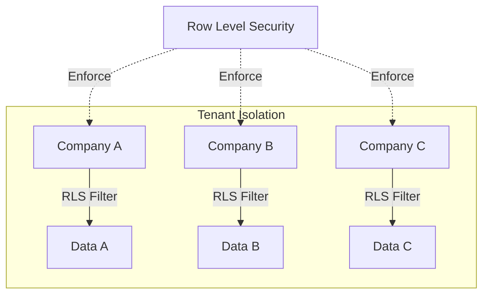
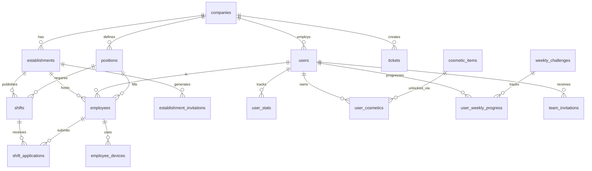

# 🗄️ Documentation Base de Données - Shift Express

**Version**: 2.0.0
**Dernière mise à jour**: 2025-10-17
**Schéma**: PostgreSQL 15+ (Supabase)

---

## 📋 Table des Matières

- [Vue d'ensemble](#vue-densemble)
- [Schéma Complet](#schéma-complet)
- [Tables Principales](#tables-principales)
  - [Core Business](#core-business)
  - [Système de Gamification](#système-de-gamification)
  - [Système d'Invitations](#système-dinvitations)
  - [Support & Audit](#support--audit)
- [Fonctions & Triggers](#fonctions--triggers)
- [Row Level Security (RLS)](#row-level-security-rls)
- [Indexes & Performance](#indexes--performance)
- [Enums](#enums)
- [Migrations](#migrations)

---

## 🏗️ Vue d'ensemble

### Architecture Multi-Tenant

La base de données utilise une architecture multi-tenant isolée par `company_id` avec Row Level Security (RLS) pour garantir l'isolation des données entre entreprises clientes.



### Technologies

- **SGBD**: PostgreSQL 15+ (Supabase)
- **ORM**: Supabase JS Client (avec types TypeScript auto-générés)
- **Authentification**: Supabase Auth (JWT + RLS)
- **Migrations**: Supabase CLI
- **Backup**: Automatique quotidien (Supabase)

### Statistiques Actuelles

- **Tables**: 27
- **Fonctions**: 41
- **Enums**: 8
- **Triggers**: 6
- **Cron Jobs**: 3

---

## 📊 Schéma Complet

### Tables Core Business



---

## 📋 Tables Principales

### Core Business

#### `companies`
Table centrale du système multi-tenant. Chaque entreprise cliente a une entrée.

| Colonne | Type | Contraintes | Défaut | Description |
|---------|------|-------------|--------|-------------|
| `id` | UUID | PK | gen_random_uuid() | Identifiant unique |
| `name` | TEXT | NOT NULL | - | Nom de l'entreprise |
| `logo_url` | TEXT | - | NULL | URL du logo |
| `subscription_plan` | ENUM | - | 'free' | Plan: free, pro, ultra, enterprise |
| `subscription_status` | ENUM | - | 'trialing' | active, trialing, past_due, canceled, incomplete |
| `subscription_interval` | TEXT | - | NULL | 'month' ou 'year' |
| `stripe_customer_id` | TEXT | UNIQUE | NULL | ID client Stripe |
| `stripe_subscription_id` | TEXT | UNIQUE | NULL | ID subscription Stripe |
| `subscription_current_period_end` | TIMESTAMPTZ | - | NULL | Fin période actuelle |
| `cancel_at_period_end` | BOOLEAN | - | false | Annulation prévue |
| `trial_ends_at` | TIMESTAMPTZ | - | NULL | Fin de la période d'essai |
| `default_language` | ENUM | - | 'fr' | fr, en, es, it, zh |
| `created_at` | TIMESTAMPTZ | - | now() | Date de création |
| `updated_at` | TIMESTAMPTZ | - | now() | Dernière mise à jour |

**Fonctions associées**:
- `get_subscription_limits(plan)` - Retourne max_establishments, max_shifts, etc.
- `delete_company(company_id)` - Suppression sécurisée avec cascade

**RLS Policies**:
- Admins voient leur propre company uniquement

---

#### `establishments`
Sites physiques des entreprises (restaurants, hôtels, magasins, etc.)

| Colonne | Type | Contraintes | Défaut | Description |
|---------|------|-------------|--------|-------------|
| `id` | UUID | PK | gen_random_uuid() | Identifiant unique |
| `company_id` | UUID | FK NOT NULL | - | → companies(id) |
| `name` | TEXT | NOT NULL | - | Nom de l'établissement |
| `address` | TEXT | - | NULL | Adresse complète |
| `city` | TEXT | - | NULL | Ville |
| `postal_code` | TEXT | - | NULL | Code postal |
| `status` | ENUM | - | 'active' | active, standby |
| `created_at` | TIMESTAMPTZ | - | now() | Date de création |
| `updated_at` | TIMESTAMPTZ | - | now() | Dernière mise à jour |

**Limites par plan**:
- Free: 1 établissement
- Pro: 3 établissements
- Ultra: 10 établissements
- Enterprise: Illimité

**Triggers**:
- `check_establishment_limit` (BEFORE INSERT) - Valide les limites du plan

---

#### `positions`
Postes de travail disponibles dans les établissements

| Colonne | Type | Contraintes | Défaut | Description |
|---------|------|-------------|--------|-------------|
| `id` | UUID | PK | gen_random_uuid() | Identifiant unique |
| `company_id` | UUID | FK NOT NULL | - | → companies(id) |
| `establishment_id` | UUID | FK | NULL | → establishments(id) |
| `title` | TEXT | NOT NULL | - | Nom du poste (ex: "Serveur", "Cuisinier") |
| `description` | TEXT | - | NULL | Description du poste |
| `default_hourly_rate` | NUMERIC(10,2) | - | NULL | Taux horaire par défaut (€) |
| `created_at` | TIMESTAMPTZ | - | now() | Date de création |
| `updated_at` | TIMESTAMPTZ | - | now() | Dernière mise à jour |

---

#### `users`
Profils utilisateurs étendant auth.users

| Colonne | Type | Contraintes | Défaut | Description |
|---------|------|-------------|--------|-------------|
| `id` | UUID | PK | - | Matches auth.users(id) |
| `email` | TEXT | NOT NULL UNIQUE | - | Email de connexion |
| `first_name` | TEXT | - | NULL | Prénom |
| `last_name` | TEXT | - | NULL | Nom |
| `phone` | TEXT | - | NULL | Téléphone |
| `role` | ENUM | NOT NULL | 'employee' | admin, manager, employee |
| `company_id` | UUID | FK | NULL | → companies(id) |
| `assigned_establishment_id` | UUID | FK | NULL | → establishments(id) |
| `points` | INTEGER | - | 0 | Points totaux (legacy, voir user_stats) |
| `level` | INTEGER | - | 1 | Niveau (legacy, voir user_stats) |
| `weekly_points` | INTEGER | - | 0 | Points hebdo (legacy, voir user_stats) |
| `created_at` | TIMESTAMPTZ | - | now() | Date de création |
| `updated_at` | TIMESTAMPTZ | - | now() | Dernière mise à jour |

**Note**: Les champs points/level/weekly_points sont dupliqués dans user_stats. Utiliser user_stats comme source de vérité.

**Fonctions associées**:
- `signup_employer(email, password, company_name)` - Inscription employeur
- `complete_employer_signup(user_id, company_name)` - Finalisation onboarding
- `can_access_establishment(user_id, establishment_id)` - Vérification permission

**Triggers**:
- Auto-création de user_stats à l'insertion

---

#### `employees`
Profil des employés liés aux établissements

| Colonne | Type | Contraintes | Défaut | Description |
|---------|------|-------------|--------|-------------|
| `id` | UUID | PK | gen_random_uuid() | Identifiant unique |
| `user_id` | UUID | FK NOT NULL UNIQUE | - | → users(id) |
| `company_id` | UUID | FK NOT NULL | - | → companies(id) |
| `establishment_id` | UUID | FK | NULL | → establishments(id) |
| `active` | BOOLEAN | - | true | Employé actif |
| `hourly_rate` | NUMERIC(10,2) | - | NULL | Taux horaire (€) |
| `reliability_score` | NUMERIC(3,2) | - | 1.00 | Score 0.00-1.00 |
| `avg_response_time_seconds` | INTEGER | - | NULL | Temps de réponse moyen |
| `total_shifts_proposed` | INTEGER | - | 0 | Shifts proposés |
| `total_shifts_accepted` | INTEGER | - | 0 | Shifts acceptés |
| `total_shifts_completed` | INTEGER | - | 0 | Shifts complétés |
| `total_shifts_rejected` | INTEGER | - | 0 | Shifts rejetés |
| `total_shifts_withdrawn` | INTEGER | - | 0 | Shifts retirés |
| `total_no_shows` | INTEGER | - | 0 | Absences non justifiées |
| `created_at` | TIMESTAMPTZ | - | now() | Date de création |
| `updated_at` | TIMESTAMPTZ | - | now() | Dernière mise à jour |

**Contraintes**:
- UNIQUE(user_id) - Un user = 1 employee

**Fonctions associées**:
- `calculate_reliability_score(employee_id)` - Calcul du score de fiabilité
- `recalculate_all_reliability_scores()` - Recalcul batch

**Triggers**:
- Auto-mise à jour des stats sur changement de shift_application

---

#### `shifts`
Shifts créés par les employeurs

| Colonne | Type | Contraintes | Défaut | Description |
|---------|------|-------------|--------|-------------|
| `id` | UUID | PK | gen_random_uuid() | Identifiant unique |
| `company_id` | UUID | FK NOT NULL | - | → companies(id) |
| `establishment_id` | UUID | FK NOT NULL | - | → establishments(id) |
| `position_id` | UUID | FK NOT NULL | - | → positions(id) |
| `start_time` | TIMESTAMPTZ | NOT NULL | - | Début du shift |
| `end_time` | TIMESTAMPTZ | NOT NULL | - | Fin du shift |
| `break_duration_minutes` | INTEGER | - | 0 | Pause (minutes) |
| `required_employees` | INTEGER | - | 1 | Nombre d'employés requis |
| `filled_employees` | INTEGER | - | 0 | Nombre d'employés acceptés |
| `status` | ENUM | - | 'pending' | pending, partially_filled, filled, completed, canceled, closed, expired |
| `description` | TEXT | - | NULL | Description du shift |
| `published_at` | TIMESTAMPTZ | - | NULL | Date de publication |
| `filled_at` | TIMESTAMPTZ | - | NULL | Date de remplissage complet |
| `created_at` | TIMESTAMPTZ | - | now() | Date de création |
| `updated_at` | TIMESTAMPTZ | - | now() | Dernière mise à jour |

**Limites par plan**:
- Free: 1 shift actif max
- Pro+: Illimité

**Indexes**:
- `idx_shifts_company_status` sur (company_id, status)
- `idx_shifts_establishment` sur (establishment_id)
- `idx_shifts_start_time` sur (start_time) WHERE status IN ('open', 'partially_filled')

**Fonctions associées**:
- `auto_complete_shifts()` - Cron quotidien pour marquer shifts passés comme completed
- `expire_old_shifts()` - Cron quotidien pour expirer shifts non remplis

**Triggers**:
- `check_shift_limit` (BEFORE INSERT) - Valide les limites du plan

---

#### `shift_applications`
Candidatures des employés aux shifts

| Colonne | Type | Contraintes | Défaut | Description |
|---------|------|-------------|--------|-------------|
| `id` | UUID | PK | gen_random_uuid() | Identifiant unique |
| `shift_id` | UUID | FK NOT NULL | - | → shifts(id) |
| `user_id` | UUID | FK NOT NULL | - | → users(id) |
| `status` | ENUM | - | 'pending' | pending, accepted, rejected, applied, withdrawn |
| `message` | TEXT | - | NULL | Message de candidature |
| `response_time_seconds` | INTEGER | - | NULL | Temps de réponse (secondes) |
| `no_show` | BOOLEAN | - | false | Absence non justifiée |
| `no_show_reported_by` | UUID | FK | NULL | → users(id) |
| `no_show_reported_at` | TIMESTAMPTZ | - | NULL | Date de signalement |
| `reviewed_by` | UUID | FK | NULL | → users(id) |
| `reviewed_at` | TIMESTAMPTZ | - | NULL | Date de review |
| `viewed_at` | TIMESTAMPTZ | - | NULL | Date de consultation |
| `applied_at` | TIMESTAMPTZ | - | now() | Date de candidature |

**Contraintes**:
- UNIQUE(shift_id, user_id) - 1 candidature par shift

**Indexes**:
- `idx_applications_shift_user` sur (shift_id, user_id)
- `idx_applications_status` sur (status) WHERE status = 'pending'
- `idx_applications_user_status` sur (user_id, status)

**RLS Policies** (Fixées dans migration 20251012192924):
- `users_select_own_applications` - Users voient leurs candidatures
- `users_insert_own_applications` - Users créent leurs candidatures
- `users_update_own_applications` - Users mettent à jour leurs candidatures
- `users_delete_own_applications` - Users suppriment leurs candidatures
- `employers_view_company_applications` - Employers voient candidatures de leur company
- `employers_update_company_applications` - Employers mettent à jour candidatures de leur company

**Triggers**:
- `trigger_notify_new_shift` (AFTER INSERT) - Envoie push notification

---

### Système de Gamification

#### `user_stats`
Statistiques et progression des utilisateurs

| Colonne | Type | Contraintes | Défaut | Description |
|---------|------|-------------|--------|-------------|
| `user_id` | UUID | PK FK | - | → users(id) |
| `total_points` | INTEGER | - | 0 | Points totaux accumulés |
| `weekly_points` | INTEGER | - | 0 | Points de la semaine |
| `current_streak_days` | INTEGER | - | 0 | Série de jours consécutifs |
| `best_streak_days` | INTEGER | - | 0 | Meilleure série |
| `last_login_date` | DATE | - | NULL | Dernière connexion |
| `total_shifts_accepted` | INTEGER | - | 0 | Shifts acceptés |
| `total_shifts_completed` | INTEGER | - | 0 | Shifts complétés |
| `total_shifts_cancelled` | INTEGER | - | 0 | Shifts annulés |
| `total_shifts_offered` | INTEGER | - | 0 | Shifts proposés |
| `responses_under_2min` | INTEGER | - | 0 | Réponses < 2min |
| `responses_2_to_5min` | INTEGER | - | 0 | Réponses 2-5min |
| `avg_response_time_minutes` | NUMERIC(10,2) | - | NULL | Temps de réponse moyen |
| `morning_shifts_accepted` | INTEGER | - | 0 | Shifts matin acceptés (5h-12h) |
| `night_shifts_accepted` | INTEGER | - | 0 | Shifts nuit acceptés (20h-5h) |
| `weekend_shifts_completed` | INTEGER | - | 0 | Shifts weekend complétés |
| `no_cancellation_streak` | INTEGER | - | 0 | Série sans annulation |
| `first_responder_count` | INTEGER | - | 0 | Nombre de fois 1er à répondre |
| `week_start_date` | DATE | - | current week | Début de la semaine actuelle |
| `last_reset_at` | TIMESTAMPTZ | - | NULL | Dernière réinit hebdo |
| `equipped_avatar_id` | UUID | FK | NULL | → cosmetic_items(id) |
| `equipped_title_id` | UUID | FK | NULL | → cosmetic_items(id) |
| `equipped_badge_id` | UUID | FK | NULL | → cosmetic_items(id) |
| `equipped_frame_id` | UUID | FK | NULL | → cosmetic_items(id) |
| `equipped_color_id` | UUID | FK | NULL | → cosmetic_items(id) |
| `created_at` | TIMESTAMPTZ | - | now() | Date de création |
| `updated_at` | TIMESTAMPTZ | - | now() | Dernière mise à jour |

**Indexes**:
- `idx_user_stats_weekly_points` sur (weekly_points DESC) - Leaderboard hebdo
- `idx_user_stats_total_points` sur (total_points DESC) - Leaderboard total

**Fonctions associées**:
- `increment_user_points(user_id, points)` - Ajoute des points
- `increment_user_stat(user_id, stat_name, increment)` - Incrémente stat spécifique
- `reset_user_stat(user_id, stat_name)` - Réinitialise stat
- `add_xp_to_user(user_id, amount, reason)` - Ajoute XP avec raison

**Triggers**:
- Reset hebdomadaire automatique (cron: lundis 00:00 UTC)

---

#### `cosmetic_items`
Catalogue des items cosmétiques déblocables

| Colonne | Type | Contraintes | Défaut | Description |
|---------|------|-------------|--------|-------------|
| `id` | UUID | PK | gen_random_uuid() | Identifiant unique |
| `type` | TEXT | NOT NULL | - | avatar, frame, badge, title, color |
| `name` | TEXT | NOT NULL | - | Nom de l'item |
| `description` | TEXT | - | NULL | Description |
| `rarity` | TEXT | NOT NULL | 'common' | common, rare, epic, legendary |
| `preview_url` | TEXT | - | NULL | URL ou gradient:#hex,#hex,... |
| `points_cost` | INTEGER | NOT NULL | 0 | Coût en points (0 = cadeau) |
| `unlock_requirement` | JSONB | - | NULL | Conditions de déblocage |
| `is_active` | BOOLEAN | - | true | Item disponible |
| `sort_order` | INTEGER | - | 0 | Ordre d'affichage |
| `created_at` | TIMESTAMPTZ | - | now() | Date de création |
| `updated_at` | TIMESTAMPTZ | - | now() | Dernière mise à jour |

**Types**: avatar | frame | badge | title | color

**Raretés et Coûts Typiques**:
- `common`: Gratuits (items de démarrage)
- `rare`: 500-700 points
- `epic`: 1500-3500 points
- `legendary`: 7000-15000 points

**Format Preview URL**:
- Images: URL standard (https://...)
- Gradients: `gradient:#ec4899,#8b5cf6,#3b82f6`

**Seeding**: 61 items pré-créés dans migrations

---

#### `user_cosmetics`
Inventaire des cosmétiques débloqués par utilisateur

| Colonne | Type | Contraintes | Défaut | Description |
|---------|------|-------------|--------|-------------|
| `id` | UUID | PK | gen_random_uuid() | Identifiant unique |
| `user_id` | UUID | FK NOT NULL | - | → users(id) |
| `cosmetic_item_id` | UUID | FK NOT NULL | - | → cosmetic_items(id) |
| `is_equipped` | BOOLEAN | - | false | Item équipé |
| `unlocked_at` | TIMESTAMPTZ | - | now() | Date de déblocage |
| `created_at` | TIMESTAMPTZ | - | now() | Date de création |

**Contraintes**:
- UNIQUE(user_id, cosmetic_item_id)

**Indexes**:
- `idx_user_cosmetics_user` sur (user_id)

**Fonctions associées**:
- `unlock_badge_for_user(user_id, badge_id)` - Débloque cosmétique

---

#### `weekly_challenges`
Défis hebdomadaires pour les employés

| Colonne | Type | Contraintes | Défaut | Description |
|---------|------|-------------|--------|-------------|
| `id` | UUID | PK | gen_random_uuid() | Identifiant unique |
| `challenge_key` | TEXT | NOT NULL UNIQUE | - | Clé technique du défi |
| `name` | TEXT | NOT NULL | - | Nom du défi |
| `description` | TEXT | NOT NULL | - | Description |
| `points_reward` | INTEGER | NOT NULL | - | Points à gagner |
| `target_count` | INTEGER | - | 1 | Objectif à atteindre |
| `icon` | TEXT | - | NULL | Icône (emoji ou URL) |
| `is_active` | BOOLEAN | - | true | Défi actif |
| `sort_order` | INTEGER | - | 0 | Ordre d'affichage |
| `created_at` | TIMESTAMPTZ | - | now() | Date de création |
| `updated_at` | TIMESTAMPTZ | - | now() | Dernière mise à jour |

**Défis Actifs** (7 pré-seedés):
1. `accept_3_shifts` - Accepter 3 shifts (100 pts, target: 3)
2. `complete_5_shifts` - Compléter 5 shifts (200 pts, target: 5)
3. `fast_responder` - 3 réponses < 2min (150 pts, target: 3)
4. `weekend_warrior` - 2 shifts weekend (150 pts, target: 2)
5. `morning_person` - 3 shifts matin (120 pts, target: 3)
6. `night_owl` - 2 shifts nuit (120 pts, target: 2)
7. `perfect_week` - Aucune annulation (250 pts, target: 1)

---

#### `user_weekly_progress`
Progression hebdomadaire des utilisateurs sur les défis

| Colonne | Type | Contraintes | Défaut | Description |
|---------|------|-------------|--------|-------------|
| `id` | UUID | PK | gen_random_uuid() | Identifiant unique |
| `user_id` | UUID | FK NOT NULL | - | → users(id) |
| `challenge_id` | UUID | FK NOT NULL | - | → weekly_challenges(id) |
| `week_start_date` | DATE | NOT NULL | - | Début de la semaine |
| `current_count` | INTEGER | - | 0 | Progression actuelle |
| `completed` | BOOLEAN | - | false | Défi complété |
| `claimed` | BOOLEAN | - | false | Récompense récupérée |
| `completed_at` | TIMESTAMPTZ | - | NULL | Date de complétion |
| `claimed_at` | TIMESTAMPTZ | - | NULL | Date de réclamation |
| `created_at` | TIMESTAMPTZ | - | now() | Date de création |
| `updated_at` | TIMESTAMPTZ | - | now() | Dernière mise à jour |

**Contraintes**:
- UNIQUE(user_id, challenge_id, week_start_date)

**Indexes**:
- `idx_user_progress_user_week` sur (user_id, week_start_date)

**Fonctions associées** (Fixées dans migration 20251012201326):
- `increment_challenge_progress(user_id, challenge_id, increment, week_start)` - Incrémente progression
- `claim_challenge_reward(user_id, challenge_id, week_start)` - Réclame récompense avec rate limiting

---

#### `challenges` (Legacy)
Ancien système de challenges génériques (remplacé par weekly_challenges)

| Colonne | Type | Contraintes | Défaut | Description |
|---------|------|-------------|--------|-------------|
| `id` | UUID | PK | gen_random_uuid() | Identifiant unique |
| `name` | TEXT | NOT NULL | - | Nom du challenge |
| `description` | TEXT | - | NULL | Description |
| `points_reward` | INTEGER | NOT NULL | - | Points récompense |
| `target_value` | INTEGER | - | NULL | Valeur cible |
| `active` | BOOLEAN | - | true | Challenge actif |
| `created_at` | TIMESTAMPTZ | - | now() | Date de création |
| `updated_at` | TIMESTAMPTZ | - | now() | Dernière mise à jour |

**Status**: Table legacy conservée pour rétrocompatibilité

---

#### `employee_challenges` (Legacy)
Ancien système de progression par employé (remplacé par user_weekly_progress)

| Colonne | Type | Contraintes | Défaut | Description |
|---------|------|-------------|--------|-------------|
| `id` | UUID | PK | gen_random_uuid() | Identifiant unique |
| `employee_id` | UUID | FK | - | → employees(id) |
| `challenge_id` | UUID | FK | - | → challenges(id) |
| `progress` | INTEGER | - | 0 | Progression |
| `completed_at` | TIMESTAMPTZ | - | NULL | Date de complétion |

**Status**: Table legacy conservée pour migration

---

#### `rewards`
Catalogue des récompenses échangeables

| Colonne | Type | Contraintes | Défaut | Description |
|---------|------|-------------|--------|-------------|
| `id` | UUID | PK | gen_random_uuid() | Identifiant unique |
| `name` | TEXT | NOT NULL | - | Nom de la récompense |
| `description` | TEXT | - | NULL | Description |
| `type` | TEXT | NOT NULL | 'voucher' | voucher, physical, digital |
| `value` | NUMERIC(10,2) | NOT NULL | 0 | Valeur (€) |
| `points_required` | INTEGER | NOT NULL | - | Points requis |
| `stock_quantity` | INTEGER | - | NULL | Stock disponible |
| `image_url` | TEXT | - | NULL | Image de la récompense |
| `is_active` | BOOLEAN | - | true | Récompense active |
| `created_at` | TIMESTAMPTZ | - | now() | Date de création |
| `updated_at` | TIMESTAMPTZ | - | now() | Dernière mise à jour |

---

#### `employee_rewards`
Historique d'échange de récompenses

| Colonne | Type | Contraintes | Défaut | Description |
|---------|------|-------------|--------|-------------|
| `id` | UUID | PK | gen_random_uuid() | Identifiant unique |
| `employee_id` | UUID | FK NOT NULL | - | → employees(id) |
| `reward_id` | UUID | FK NOT NULL | - | → rewards(id) |
| `status` | TEXT | - | 'pending' | pending, issued, used, expired |
| `voucher_code` | TEXT | UNIQUE | NULL | Code du voucher |
| `redeemed_at` | TIMESTAMPTZ | - | now() | Date d'échange |
| `used_at` | TIMESTAMPTZ | - | NULL | Date d'utilisation |

---

### Système d'Invitations

#### `establishment_invitations`
QR code / link-based employee recruitment

| Colonne | Type | Contraintes | Défaut | Description |
|---------|------|-------------|--------|-------------|
| `id` | UUID | PK | gen_random_uuid() | Identifiant unique |
| `company_id` | UUID | FK NOT NULL | - | → companies(id) |
| `establishment_id` | UUID | FK NOT NULL | - | → establishments(id) |
| `created_by` | UUID | FK NOT NULL | - | → users(id) |
| `token` | TEXT | NOT NULL UNIQUE | - | Token d'invitation |
| `description` | TEXT | - | NULL | Description |
| `max_uses` | INTEGER | - | NULL | Utilisations max |
| `current_uses` | INTEGER | - | 0 | Utilisations actuelles |
| `expires_at` | TIMESTAMPTZ | - | NULL | Date d'expiration |
| `is_active` | BOOLEAN | - | true | Invitation active |
| `last_used_at` | TIMESTAMPTZ | - | NULL | Dernière utilisation |
| `metadata` | JSONB | - | NULL | Métadonnées additionnelles |
| `created_at` | TIMESTAMPTZ | - | now() | Date de création |

**Contraintes**:
- UNIQUE(token)

**Fonctions associées**:
- `generate_invitation_token()` - Génère token unique
- `validate_invitation_token_readonly(token)` - Valide sans side effects
- `validate_invitation_token(token, user_id, employee_id, ip, user_agent)` - Validation complète
- `increment_invitation_uses(token)` - Incrémente compteur

---

#### `establishment_invitation_signups`
Tracking des inscriptions via invitations

| Colonne | Type | Contraintes | Défaut | Description |
|---------|------|-------------|--------|-------------|
| `id` | UUID | PK | gen_random_uuid() | Identifiant unique |
| `invitation_id` | UUID | FK NOT NULL | - | → establishment_invitations(id) |
| `user_id` | UUID | FK NOT NULL | - | → users(id) |
| `employee_id` | UUID | FK NOT NULL | - | → employees(id) |
| `ip_address` | INET | - | NULL | Adresse IP |
| `user_agent` | TEXT | - | NULL | User agent |
| `metadata` | JSONB | - | NULL | Métadonnées additionnelles |
| `signed_up_at` | TIMESTAMPTZ | - | now() | Date d'inscription |

**Indexes**:
- Index sur (invitation_id)
- Index sur (user_id)

---

#### `team_invitations`
Invitations pour managers/admins

| Colonne | Type | Contraintes | Défaut | Description |
|---------|------|-------------|--------|-------------|
| `id` | UUID | PK | gen_random_uuid() | Identifiant unique |
| `company_id` | UUID | FK NOT NULL | - | → companies(id) |
| `establishment_id` | UUID | FK | NULL | → establishments(id) |
| `created_by` | UUID | FK | NULL | → users(id) |
| `email` | TEXT | NOT NULL | - | Email de l'invité |
| `first_name` | TEXT | - | NULL | Prénom |
| `last_name` | TEXT | - | NULL | Nom |
| `role` | TEXT | - | NULL | admin, manager |
| `token` | TEXT | NOT NULL UNIQUE | - | Token d'invitation |
| `expires_at` | TIMESTAMPTZ | - | now() + 7 days | Date d'expiration |
| `accepted_at` | TIMESTAMPTZ | - | NULL | Date d'acceptation |
| `created_at` | TIMESTAMPTZ | - | now() | Date de création |
| `updated_at` | TIMESTAMPTZ | - | now() | Dernière mise à jour |

**Fonctions associées**:
- `accept_manager_invitation(token, first_name, last_name, password)` - Acceptation invitation
- `get_invitation_by_token(token)` - Récupération détails

---

### Support & Audit

#### `tickets`
Système de support client

| Colonne | Type | Contraintes | Défaut | Description |
|---------|------|-------------|--------|-------------|
| `id` | UUID | PK | gen_random_uuid() | Identifiant unique |
| `company_id` | UUID | FK NOT NULL | - | → companies(id) |
| `user_id` | UUID | FK NOT NULL | - | → users(id) |
| `subject` | TEXT | NOT NULL | - | Sujet du ticket |
| `status` | ENUM | - | 'open' | open, in_progress, resolved, closed |
| `priority` | TEXT | - | 'normal' | low, normal, high, urgent |
| `created_at` | TIMESTAMPTZ | - | now() | Date de création |
| `updated_at` | TIMESTAMPTZ | - | now() | Dernière mise à jour |

---

#### `ticket_messages`
Messages des tickets

| Colonne | Type | Contraintes | Défaut | Description |
|---------|------|-------------|--------|-------------|
| `id` | UUID | PK | gen_random_uuid() | Identifiant unique |
| `ticket_id` | UUID | FK NOT NULL | - | → tickets(id) |
| `user_id` | UUID | FK NOT NULL | - | → users(id) |
| `message` | TEXT | NOT NULL | - | Contenu du message |
| `is_internal` | BOOLEAN | - | false | Note interne |
| `created_at` | TIMESTAMPTZ | - | now() | Date de création |

---

#### `audit_logs`
Logs d'audit de sécurité et conformité

| Colonne | Type | Contraintes | Défaut | Description |
|---------|------|-------------|--------|-------------|
| `id` | UUID | PK | gen_random_uuid() | Identifiant unique |
| `user_id` | UUID | FK | NULL | → users(id) |
| `user_email` | TEXT | - | NULL | Email de l'utilisateur |
| `event_type` | TEXT | NOT NULL | - | Type d'événement |
| `path` | TEXT | NOT NULL | - | Chemin API |
| `method` | TEXT | - | NULL | Méthode HTTP |
| `ip_address` | TEXT | NOT NULL | - | Adresse IP |
| `user_agent` | TEXT | - | NULL | User agent |
| `details` | JSONB | - | NULL | Détails additionnels |
| `created_at` | TIMESTAMPTZ | NOT NULL | now() | Date de création |

**Indexes**:
- Index sur (user_id, created_at)
- Index sur (event_type, created_at)

**Fonctions associées**:
- `cleanup_old_audit_logs()` - Cron pour nettoyer logs anciens

---

#### `otp_codes`
Codes OTP pour authentification passwordless

| Colonne | Type | Contraintes | Défaut | Description |
|---------|------|-------------|--------|-------------|
| `id` | UUID | PK | gen_random_uuid() | Identifiant unique |
| `email` | TEXT | NOT NULL | - | Email de l'utilisateur |
| `code` | TEXT | NOT NULL | - | Code OTP |
| `used` | BOOLEAN | - | false | Code utilisé |
| `created_at` | TIMESTAMPTZ | NOT NULL | now() | Date de création |
| `expires_at` | TIMESTAMPTZ | NOT NULL | now() + 60 min | Date d'expiration |

**Indexes**:
- Index sur (email, used, expires_at)

**Expiration**: 60 minutes

---

#### `employee_devices`
Tokens de push notification

| Colonne | Type | Contraintes | Défaut | Description |
|---------|------|-------------|--------|-------------|
| `id` | UUID | PK | gen_random_uuid() | Identifiant unique |
| `employee_id` | UUID | FK NOT NULL | - | → employees(id) |
| `push_token` | TEXT | NOT NULL UNIQUE | - | Token Expo Push |
| `platform` | TEXT | - | NULL | ios, android |
| `created_at` | TIMESTAMPTZ | - | now() | Date de création |
| `updated_at` | TIMESTAMPTZ | - | now() | Dernière mise à jour |

**Contraintes**:
- UNIQUE(push_token)

**Indexes**:
- Index sur (employee_id)

---

#### `admin_whitelist`
Contrôle d'accès administrateur plateforme

| Colonne | Type | Contraintes | Défaut | Description |
|---------|------|-------------|--------|-------------|
| `id` | UUID | PK | gen_random_uuid() | Identifiant unique |
| `email` | TEXT | NOT NULL UNIQUE | - | Email admin |
| `role` | TEXT | - | NULL | Rôle spécifique |
| `is_active` | BOOLEAN | - | true | Actif |
| `created_at` | TIMESTAMPTZ | - | now() | Date de création |
| `updated_at` | TIMESTAMPTZ | - | now() | Dernière mise à jour |

---

#### `user_roles`
Assignation de rôles utilisateurs

| Colonne | Type | Contraintes | Défaut | Description |
|---------|------|-------------|--------|-------------|
| `user_id` | UUID | PK FK | - | → users(id) |
| `company_id` | UUID | FK | NULL | → companies(id) |
| `assigned_establishment_id` | UUID | FK | NULL | → establishments(id) |
| `role` | TEXT | NOT NULL | - | admin, manager, employee |
| `created_at` | TIMESTAMPTZ | - | now() | Date de création |
| `updated_at` | TIMESTAMPTZ | - | now() | Dernière mise à jour |

---

#### `user_permissions`
Système de permissions granulaire

| Colonne | Type | Contraintes | Défaut | Description |
|---------|------|-------------|--------|-------------|
| `id` | UUID | PK | gen_random_uuid() | Identifiant unique |
| `user_id` | UUID | FK NOT NULL | - | → users(id) |
| `permission` | TEXT | NOT NULL | - | Permission |
| `resource_type` | TEXT | - | NULL | Type de ressource |
| `resource_id` | UUID | - | NULL | ID de la ressource |
| `created_at` | TIMESTAMPTZ | - | now() | Date de création |

---

## ⚙️ Fonctions & Triggers

### Fonctions de Gamification

#### `increment_user_points(user_id UUID, points INTEGER)`
Ajoute des points à un utilisateur et vérifie le déblocage de badges

```sql
SELECT increment_user_points('user-uuid', 100);
```

**Fonctionnalité**:
- Incrémente total_points et weekly_points
- Appelle automatiquement `check_and_unlock_badges()`
- Met à jour updated_at

---

#### `increment_user_stat(user_id UUID, stat_name TEXT, increment INTEGER)`
Incrémente une statistique spécifique

```sql
SELECT increment_user_stat('user-uuid', 'responses_under_2min', 1);
```

**Stats disponibles**: Toutes les colonnes INTEGER de user_stats

---

#### `increment_challenge_progress(user_id UUID, challenge_id UUID, increment INTEGER, week_start DATE)`
Incrémente la progression d'un défi hebdomadaire

```sql
SELECT increment_challenge_progress(
  'user-uuid',
  'challenge-uuid',
  1,
  '2025-10-13'::date
);
```

**Fonctionnalité**:
- Upsert sur user_weekly_progress
- Marque automatiquement comme completed si target atteint
- Safe pour appels multiples (idempotent)

---

#### `claim_challenge_reward(user_id UUID, challenge_id UUID, week_start DATE)`
Réclame la récompense d'un défi complété (avec rate limiting)

```sql
SELECT claim_challenge_reward(
  'user-uuid',
  'challenge-uuid',
  '2025-10-13'::date
);
```

**Retour**: JSON avec `success`, `points_awarded`, ou `error`

**Sécurité**:
- Vérifie que le défi est completed
- Vérifie que la récompense n'a pas déjà été claimed
- Rate limiting pour éviter les doubles claims

**Fixé dans**: Migration 20251012201326

---

#### `check_and_unlock_badges(user_id UUID)`
Vérifie et débloque automatiquement les badges correspondant aux achievements

```sql
SELECT check_and_unlock_badges('user-uuid');
```

**Badges Auto-Unlock**:
- Weekend Warrior (2 weekend shifts complétés)
- Vitesse Éclair (3 réponses < 2min)
- Autres badges basés sur unlock_requirement (JSONB)

---

#### `unlock_badge_for_user(user_id UUID, badge_id UUID)`
Débloque manuellement un cosmétique

```sql
SELECT unlock_badge_for_user('user-uuid', 'badge-uuid');
```

**Contraintes**:
- Ignore si déjà débloqué (UNIQUE)
- SECURITY DEFINER avec validation

---

#### `add_xp_to_user(user_id UUID, amount INTEGER, reason TEXT)`
Ajoute des XP avec tracking de la raison

```sql
SELECT add_xp_to_user('user-uuid', 50, 'Shift completed on time');
```

**Retour**: JSON avec nouveau total

---

### Fonctions de Gestion

#### `calculate_reliability_score(employee_id UUID)`
Calcule le score de fiabilité (0.00-1.00)

```sql
SELECT calculate_reliability_score('employee-uuid');
```

**Calcul**:
- Base: 1.00
- -15% par no-show
- -5% par cancellation
- Min: 0.00, Max: 1.00

---

#### `recalculate_all_reliability_scores()`
Recalcule tous les scores de fiabilité (batch)

```sql
SELECT recalculate_all_reliability_scores();
```

**Usage**: Cron hebdomadaire ou admin manuel

---

#### `get_subscription_limits(plan TEXT)`
Retourne les limites du plan d'abonnement

```sql
SELECT get_subscription_limits('pro');
```

**Retour**:
```json
{
  "max_establishments": 3,
  "max_shifts_active": null,
  "max_employees": null
}
```

---

#### `can_access_establishment(user_id UUID, establishment_id UUID)`
Vérifie si un utilisateur peut accéder à un établissement

```sql
SELECT can_access_establishment('user-uuid', 'establishment-uuid');
```

**Retour**: BOOLEAN

**Logique**:
- Admin: tous les établissements de sa company
- Manager: seulement son assigned_establishment_id
- Employee: tous les établissements de sa company

---

### Fonctions d'Authentification

#### `signup_employer(email TEXT, password TEXT, company_name TEXT)`
Inscription d'un nouvel employeur

```sql
SELECT signup_employer(
  'boss@example.com',
  'securepassword',
  'My Restaurant'
);
```

**Retour**: JSON avec `user_id`, `company_id`

**Actions**:
1. Crée user dans auth.users
2. Crée company
3. Crée user_stats
4. Assigne role 'admin'

---

#### `complete_employer_signup(user_id UUID, company_name TEXT)`
Finalise l'onboarding employeur

```sql
SELECT complete_employer_signup('user-uuid', 'My Company');
```

**Usage**: Après vérification email

---

### Fonctions d'Invitations

#### `generate_invitation_token()`
Génère un token unique pour invitation

```sql
SELECT generate_invitation_token();
```

**Retour**: TEXT (32 caractères alphanumériques)

---

#### `validate_invitation_token_readonly(token TEXT)`
Valide un token sans side effects

```sql
SELECT validate_invitation_token_readonly('abc123xyz');
```

**Retour**: JSON avec détails de l'invitation ou error

**Usage**: Affichage page d'invitation

---

#### `validate_invitation_token(token TEXT, user_id UUID, employee_id UUID, ip_address INET, user_agent TEXT)`
Validation complète avec tracking

```sql
SELECT validate_invitation_token(
  'abc123xyz',
  'user-uuid',
  'employee-uuid',
  '192.168.1.1',
  'Mozilla/5.0...'
);
```

**Actions**:
1. Valide token (exists, active, not expired, max_uses)
2. Crée entry dans establishment_invitation_signups
3. Incrémente current_uses
4. Met à jour last_used_at

---

#### `accept_manager_invitation(token TEXT, first_name TEXT, last_name TEXT, password TEXT)`
Accepte une invitation manager

```sql
SELECT accept_manager_invitation(
  'token123',
  'John',
  'Doe',
  'securepassword'
);
```

**Retour**: JSON avec `user_id`, `company_id`, `establishment_id`

---

### Fonctions de Maintenance

#### `auto_complete_shifts()`
Marque les shifts passés comme completed

```sql
SELECT auto_complete_shifts();
```

**Cron**: Quotidien à 01:00 UTC

**Logique**:
- end_time < NOW()
- status = 'filled'
- → status = 'completed'

---

#### `expire_old_shifts()`
Expire les shifts non remplis anciens

```sql
SELECT expire_old_shifts();
```

**Cron**: Quotidien à 02:00 UTC

**Logique**:
- start_time < NOW() - 24h
- status IN ('pending', 'partially_filled')
- → status = 'expired'

---

#### `cleanup_old_audit_logs()`
Nettoie les logs d'audit anciens

```sql
SELECT cleanup_old_audit_logs();
```

**Cron**: Quotidien à 03:00 UTC

**Logique**: DELETE logs > 90 jours

---

### Triggers

#### `initialize_user_stats()`
**Event**: AFTER INSERT ON users
**Action**: Crée automatiquement user_stats avec valeurs par défaut

---

#### `trigger_notify_new_shift()`
**Event**: AFTER INSERT ON shift_applications
**Action**: Envoie push notification au manager (Migration 20251013000000)

---

#### `check_establishment_limit()`
**Event**: BEFORE INSERT ON establishments
**Action**: Valide que la company n'excède pas son plan limit

---

#### `check_shift_limit()`
**Event**: BEFORE INSERT ON shifts
**Action**: Valide que la company n'excède pas le max_shifts_active (Free: 1)

---

## 🔐 Row Level Security (RLS)

### Principe

Chaque table utilise RLS pour isoler les données par `company_id` et `role`.

### Rôles

| Rôle | Description | Accès |
|------|-------------|-------|
| `employee` | Employé standard | Ses propres données + shifts de sa company |
| `manager` | Manager d'établissement | Données de son establishment |
| `admin` | Admin entreprise | Toutes les données de sa company |
| `superadmin` | Super admin plateforme | Accès global (debug uniquement) |

### Policies Critiques

#### `companies`
```sql
-- Admins voient leur company
CREATE POLICY "Admins can view own company"
ON companies FOR SELECT
TO authenticated
USING (
  id = (SELECT company_id FROM users WHERE id = auth.uid())
  AND (SELECT role FROM users WHERE id = auth.uid()) = 'admin'
);
```

---

#### `establishments`
```sql
-- Managers voient leur establishment
CREATE POLICY "Managers can view own establishment"
ON establishments FOR SELECT
TO authenticated
USING (
  company_id = (SELECT company_id FROM users WHERE id = auth.uid())
  AND (
    (SELECT role FROM users WHERE id = auth.uid()) = 'admin'
    OR id = (SELECT assigned_establishment_id FROM users WHERE id = auth.uid())
  )
);
```

---

#### `shifts`
```sql
-- Employees voient shifts de leur company
CREATE POLICY "Employees can view shifts"
ON shifts FOR SELECT
TO authenticated
USING (
  company_id = (SELECT company_id FROM users WHERE id = auth.uid())
);

-- Managers créent shifts de leur establishment
CREATE POLICY "Managers can create shifts"
ON shifts FOR INSERT
TO authenticated
WITH CHECK (
  establishment_id IN (
    SELECT id FROM establishments
    WHERE company_id = (SELECT company_id FROM users WHERE id = auth.uid())
  )
  AND (SELECT role FROM users WHERE id = auth.uid()) IN ('manager', 'admin')
);
```

---

#### `shift_applications`
```sql
-- Users voient leurs propres candidatures
CREATE POLICY "users_select_own_applications"
ON shift_applications FOR SELECT
TO authenticated
USING (user_id = auth.uid());

-- Employers voient candidatures de leur company
CREATE POLICY "employers_view_company_applications"
ON shift_applications FOR SELECT
TO authenticated
USING (
  shift_id IN (
    SELECT id FROM shifts
    WHERE company_id = (SELECT company_id FROM users WHERE id = auth.uid())
  )
  AND (SELECT role FROM users WHERE id = auth.uid()) IN ('manager', 'admin')
);
```

**Fixé dans**: Migration 20251012192924 (résolution récursivité infinie)

---

#### `user_stats`
```sql
-- Users voient leurs propres stats
CREATE POLICY "Users can view own stats"
ON user_stats FOR SELECT
TO authenticated
USING (user_id = auth.uid());

-- Admins voient stats de leur company
CREATE POLICY "Admins can view company stats"
ON user_stats FOR SELECT
TO authenticated
USING (
  user_id IN (
    SELECT id FROM users
    WHERE company_id = (SELECT company_id FROM users WHERE id = auth.uid())
  )
  AND (SELECT role FROM users WHERE id = auth.uid()) = 'admin'
);
```

**Note**: Leaderboard utilise une vue matérialisée sans RLS strict (anonymisé)

---

## 🚀 Indexes & Performance

### Indexes Critiques

```sql
-- Applications (recherche rapide)
CREATE INDEX idx_applications_shift_user
  ON shift_applications(shift_id, user_id);

CREATE INDEX idx_applications_status
  ON shift_applications(status)
  WHERE status = 'pending';

CREATE INDEX idx_applications_user_status
  ON shift_applications(user_id, status);

-- User Stats (leaderboard)
CREATE INDEX idx_user_stats_weekly_points
  ON user_stats(weekly_points DESC);

CREATE INDEX idx_user_stats_total_points
  ON user_stats(total_points DESC);

-- Shifts (filtres fréquents)
CREATE INDEX idx_shifts_company_status
  ON shifts(company_id, status);

CREATE INDEX idx_shifts_establishment
  ON shifts(establishment_id);

CREATE INDEX idx_shifts_start_time
  ON shifts(start_time)
  WHERE status IN ('open', 'partially_filled');

-- User Cosmetics (inventaire)
CREATE INDEX idx_user_cosmetics_user
  ON user_cosmetics(user_id);

-- Weekly Progress (défis)
CREATE INDEX idx_user_progress_user_week
  ON user_weekly_progress(user_id, week_start_date);
```

### Optimisations

- **Connection Pooling**: Supabase Pooler (mode transaction)
- **Caching**: Redis pour leaderboard (TTL: 5min)
- **Partitioning**: audit_logs par mois (si > 10M lignes)
- **Materialized Views**: Leaderboard pré-calculé (refresh 5min)

---

## 📦 Enums

### `application_status`
```sql
'pending' | 'accepted' | 'rejected' | 'applied' | 'withdrawn'
```

### `establishment_status`
```sql
'active' | 'standby'
```

### `language_code`
```sql
'fr' | 'en' | 'es' | 'it' | 'zh'
```

### `shift_status`
```sql
'pending' | 'partially_filled' | 'filled' | 'completed' | 'canceled' | 'closed' | 'expired'
```

### `subscription_plan`
```sql
'free' | 'pro' | 'ultra' | 'enterprise'
```

### `subscription_status`
```sql
'active' | 'trialing' | 'past_due' | 'canceled' | 'incomplete'
```

### `ticket_status`
```sql
'open' | 'in_progress' | 'resolved' | 'closed'
```

### `user_role`
```sql
'admin' | 'manager' | 'employee'
```

---

## 🔄 Migrations

### Structure

Les migrations sont dans `supabase/migrations/`:

```
supabase/migrations/
├── 20251012000001_prod_dump_complete.sql      # Dump initial prod
├── 20251012192924_fix_rls_recursion.sql       # Fix RLS shift_applications
├── 20251012201326_fix_claim_challenge.sql     # Fix claim_challenge_reward
├── 20251012210249_subscription_data_fix.sql   # Subscription data
├── 20251013000000_add_notification_trigger.sql # Push notifications
└── ...
```

### Commandes

```bash
# Créer nouvelle migration
npx supabase migration new <name>

# Appliquer migrations local
npx supabase db reset

# Appliquer migrations prod
npx supabase db push

# Créer migration depuis diff
npx supabase db diff -f <name>

# Lister migrations
npx supabase migration list
```

### Migrations Critiques

#### `20251012192924_fix_rls_recursion.sql`
**Problème**: Récursivité infinie dans RLS policies de shift_applications
**Solution**: Réécriture des policies pour éviter les boucles

#### `20251012201326_fix_claim_challenge.sql`
**Problème**: claim_challenge_reward utilisait employee_challenges au lieu de user_weekly_progress
**Solution**: Migration vers nouveau système weekly_challenges

#### `20251013000000_add_notification_trigger.sql`
**Ajout**: Trigger pour envoyer push notification sur nouvelle application

---

## 📊 Métriques & Monitoring

### Requêtes Lentes (> 100ms)

```sql
-- Activer pg_stat_statements
CREATE EXTENSION IF NOT EXISTS pg_stat_statements;

-- Top 10 requêtes lentes
SELECT
  query,
  calls,
  total_exec_time / 1000 AS total_seconds,
  mean_exec_time / 1000 AS avg_seconds
FROM pg_stat_statements
ORDER BY mean_exec_time DESC
LIMIT 10;
```

### Taille des Tables

```sql
SELECT
  schemaname,
  tablename,
  pg_size_pretty(pg_total_relation_size(schemaname||'.'||tablename)) AS size
FROM pg_tables
WHERE schemaname = 'public'
ORDER BY pg_total_relation_size(schemaname||'.'||tablename) DESC;
```

### Audit RLS

```sql
-- Vérifier que toutes les tables ont RLS activé
SELECT
  tablename,
  rowsecurity AS rls_enabled
FROM pg_tables
WHERE schemaname = 'public'
  AND rowsecurity = FALSE;
-- Expected: 0 rows
```

---

## 🔒 Sécurité Base de Données

### Checklist

- ✅ RLS activé sur toutes les tables
- ✅ Policies testées par rôle
- ✅ Service Role Key jamais exposée côté client
- ✅ Fonctions SECURITY DEFINER avec validation stricte
- ✅ Indexes sur colonnes filtrées (performance)
- ✅ Contraintes CHECK sur données critiques
- ✅ Cascade DELETE protégé (soft delete préféré)
- ✅ Audit logs pour actions critiques

### Tests RLS

```sql
-- Test isolation multi-tenant
SET LOCAL ROLE authenticated;
SET LOCAL request.jwt.claim.sub TO '<employee_user_id>';

SELECT * FROM shifts
WHERE company_id != (SELECT company_id FROM users WHERE id = auth.uid());
-- Expected: 0 rows (isolation OK)
```

---

## 📚 Ressources

- [Supabase Database Docs](https://supabase.com/docs/guides/database)
- [PostgreSQL 15 Docs](https://www.postgresql.org/docs/15/)
- [Row Level Security Guide](https://supabase.com/docs/guides/auth/row-level-security)
- [Types Auto-Generated](../types/database.types.ts)

---

**Version**: 2.0.0
**Dernière mise à jour**: 2025-10-17
**Prochaine review**: Mensuelle
