# 🏗️ Architecture - Shift Express

**Version**: 2.0.0
**Dernière mise à jour**: 2025-11-12

---

## 📋 Table des Matières

- [Vue d'ensemble](#vue-densemble)
- [Architecture Système](#architecture-système)
- [Architecture Base de Données](#architecture-base-de-données)
- [Flux de Données](#flux-de-données)
- [Sécurité Multi-Tenant](#sécurité-multi-tenant)
- [Déploiement](#déploiement)
- [Scalabilité](#scalabilité)

---

## 🌐 Vue d'ensemble

Shift Express est une **plateforme SaaS B2B** pour la gestion de shifts temporaires avec gamification employé.

### Stack Technique

```mermaid
graph TB
    subgraph "Frontend"
        Mobile[Mobile App<br/>React Native + Expo]
        Web[Landing Page<br/>Next.js]
        CRM[CRM Admin<br/>Next.js]
    end

    subgraph "Backend"
        API[Custom API<br/>Express.js + TypeScript]
        Supabase[Supabase<br/>PostgreSQL + Auth + Storage]
        Redis[Redis Cache<br/>Upstash]
    end

    subgraph "Deployment"
        Vercel[Vercel<br/>API + Web + CRM]
        EAS[EAS Build<br/>Mobile iOS/Android]
    end

    Mobile --> API
    Web --> API
    CRM --> API
    API --> Supabase
    API --> Redis
    API --> Vercel
    Mobile --> EAS
    Web --> Vercel
    CRM --> Vercel

    style Mobile fill:#61dafb
    style Web fill:#61dafb
    style CRM fill:#61dafb
    style API fill:#68a063
    style Supabase fill:#3ecf8e
    style Redis fill:#dc382d
    style Vercel fill:#000000
    style EAS fill:#000020
```

### Versions et Dépendances Clés

#### 📱 Mobile App (`apps/mobile`)

| Librairie | Version | Usage |
|-----------|---------|-------|
| **React** | 19.1.0 | ⚠️ **React 19** (Compatible Expo 54+) |
| **React Native** | 0.81.4 | Framework mobile |
| **Expo** | 54.0.13 | Plateforme de développement |
| **Expo Router** | 6.0.12 | Navigation file-based |
| **TypeScript** | 5.3.3 | Typage statique |
| **Zustand** | 4.4.7 | State management |
| **TanStack Query** | 5.17.9 | Server state & cache |
| **Supabase JS** | 2.39.0 | Backend client |
| **i18next** | 25.5.3 | Internationalisation (FR/EN) |
| **Sentry** | 7.2.0 | Error tracking |
| **Lucide Icons** | 0.544.0 | Icônes React Native |
| **Confetti Cannon** | 1.5.2 | Animations gamification |
| **Flash List** | 2.2.0 | Listes performantes |
| **date-fns** | 3.0.6 | Manipulation dates |

**Note importante:** L'app mobile utilise **React 19** (au lieu de React 18), ce qui est compatible avec Expo 54+. Cette version apporte des améliorations de performance et prépare le projet pour le futur.

#### 🌐 Web App (`apps/web`)

| Librairie | Version | Usage |
|-----------|---------|-------|
| **React** | 18.3.1 | UI library (stable) |
| **React DOM** | 18.3.1 | React pour le web |
| **Vite** | 5.0.11 | Build tool ultra-rapide |
| **TypeScript** | 5.3.3 | Typage statique |
| **React Router** | 6.21.1 | Routing |
| **Zustand** | 4.4.7 | State management |
| **TanStack Query** | 5.17.9 | Server state & cache |
| **TanStack Table** | 8.11.2 | Tables complexes |
| **Supabase JS** | 2.39.0 | Backend client |
| **i18next** | 25.5.3 | Internationalisation (FR/EN) |
| **Stripe JS** | 2.4.0 | Paiements |
| **Framer Motion** | 12.23.24 | Animations |
| **Recharts** | 2.15.4 | Graphiques & analytics |
| **React Hook Form** | 7.63.0 | Formulaires optimisés |
| **Zod** | 3.25.76 | Validation schémas |
| **Tailwind CSS** | 3.4.0 | Styling utility-first |
| **Lucide React** | 0.303.0 | Icônes React |
| **html2canvas** | 1.4.1 | Screenshots & exports |
| **jsPDF** | 3.0.3 | Génération PDF |
| **XLSX** | 0.18.5 | Export Excel |
| **Sentry** | 10.24.0 | Error tracking |
| **Sonner** | 1.3.1 | Toast notifications |
| **next-themes** | 0.4.6 | Dark mode |

#### 🖥️ API Server (`apps/api`)

| Librairie | Version | Usage |
|-----------|---------|-------|
| **Express** | 4.18.2 | Backend framework |
| **TypeScript** | 5.3.3 | Typage statique |
| **Supabase JS** | 2.39.0 | Database & auth client |
| **Redis (ioredis)** | 5.3.2 | Caching & rate limiting |
| **Stripe** | 14.10.0 | Webhooks & payments |
| **Winston** | 3.11.0 | Logging structuré |
| **Logtail** | 0.4.3 | Log aggregation |
| **Helmet** | 7.1.0 | Security headers |
| **CORS** | 2.8.5 | Cross-origin handling |
| **Zod** | 3.22.4 | Validation API |
| **express-rate-limit** | 7.1.5 | Rate limiting |
| **rate-limit-redis** | 4.2.0 | Rate limit storage |

#### 🗄️ Database & Backend

| Service | Version | Usage |
|---------|---------|-------|
| **PostgreSQL** | 15.x | Base de données principale |
| **Supabase** | Latest | BaaS (Auth, Storage, RLS) |
| **Upstash Redis** | Latest | Cache distribué |
| **Supabase Edge Functions** | Deno runtime | Webhooks & background jobs |

---

## 🏢 Architecture Système

### Monorepo Structure

```
shift-express/
├── apps/
│   ├── api/                # Express.js Backend
│   ├── web/                # Next.js Landing Page
│   ├── mobile/             # Expo Mobile App
│   └── crm-admin/          # Next.js CRM
├── packages/
│   ├── types/              # Shared TypeScript types
│   └── utils/              # Shared utilities
├── supabase/
│   ├── migrations/         # SQL migrations
│   ├── functions/          # Edge Functions (Deno)
│   └── seed.sql            # Initial data
└── docs/                   # Documentation
```

---

## 🗄️ Architecture Base de Données

### Schéma ERD Complet

```mermaid
erDiagram
    companies ||--o{ establishments : "has"
    companies ||--o{ users : "employs"
    companies ||--o{ positions : "defines"
    companies ||--o{ tickets : "creates"

    establishments ||--o{ employees : "hosts"
    establishments ||--o{ shifts : "publishes"
    establishments ||--o{ establishment_invitations : "generates"

    users ||--o{ employees : "is"
    users ||--o{ user_stats : "tracks"
    users ||--o{ user_cosmetics : "owns"
    users ||--o{ user_weekly_progress : "progresses"
    users ||--o{ team_invitations : "receives"

    positions ||--o{ employees : "fills"
    positions ||--o{ shifts : "requires"

    shifts ||--o{ shift_applications : "receives"

    employees ||--o{ shift_applications : "submits"
    employees ||--o{ employee_devices : "uses"

    cosmetic_items ||--o{ user_cosmetics : "unlocked_via"
    weekly_challenges ||--o{ user_weekly_progress : "tracks"

    companies {
        uuid id PK
        text name
        enum subscription_plan
        enum subscription_status
        text stripe_customer_id
        text stripe_subscription_id
    }

    establishments {
        uuid id PK
        uuid company_id FK
        text name
        text address
        enum status
    }

    users {
        uuid id PK
        text email
        enum role
        uuid company_id FK
        uuid assigned_establishment_id FK
        int points
        int level
    }

    shifts {
        uuid id PK
        uuid company_id FK
        uuid establishment_id FK
        uuid position_id FK
        timestamptz start_time
        timestamptz end_time
        enum status
        int required_employees
        int filled_employees
    }

    shift_applications {
        uuid id PK
        uuid shift_id FK
        uuid user_id FK
        enum status
        int response_time_seconds
        bool no_show
        timestamptz applied_at
    }

    user_stats {
        uuid user_id PK
        int total_points
        int weekly_points
        int current_streak_days
        int responses_under_2min
        int weekend_shifts_completed
        uuid equipped_avatar_id FK
        uuid equipped_badge_id FK
    }

    cosmetic_items {
        uuid id PK
        text type
        text name
        text rarity
        int points_cost
        jsonb unlock_requirement
        text preview_url
    }

    weekly_challenges {
        uuid id PK
        text challenge_key UNIQUE
        text name
        int points_reward
        int target_count
        bool is_active
    }

    user_weekly_progress {
        uuid id PK
        uuid user_id FK
        uuid challenge_id FK
        date week_start_date
        int current_count
        bool completed
        bool claimed
    }
```

---

## 🔄 Flux de Données

### 1. Authentification Flow

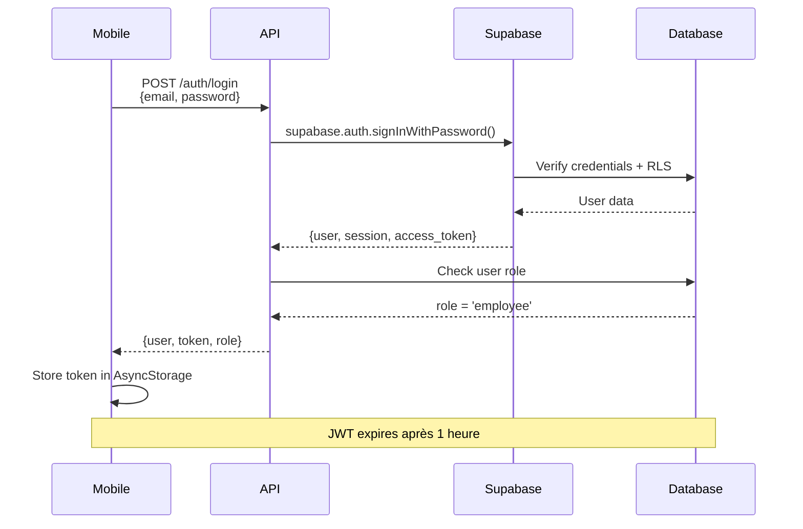

---

### 2. Shift Application Flow

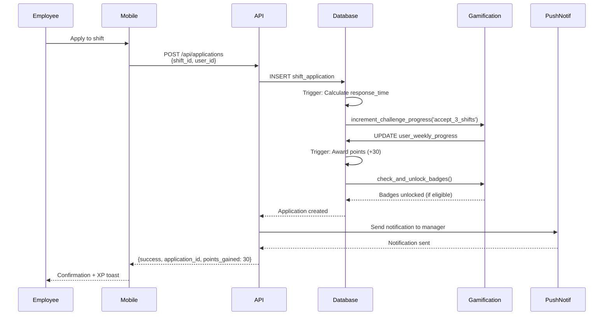

---

### 3. Weekly Challenge Claim Flow

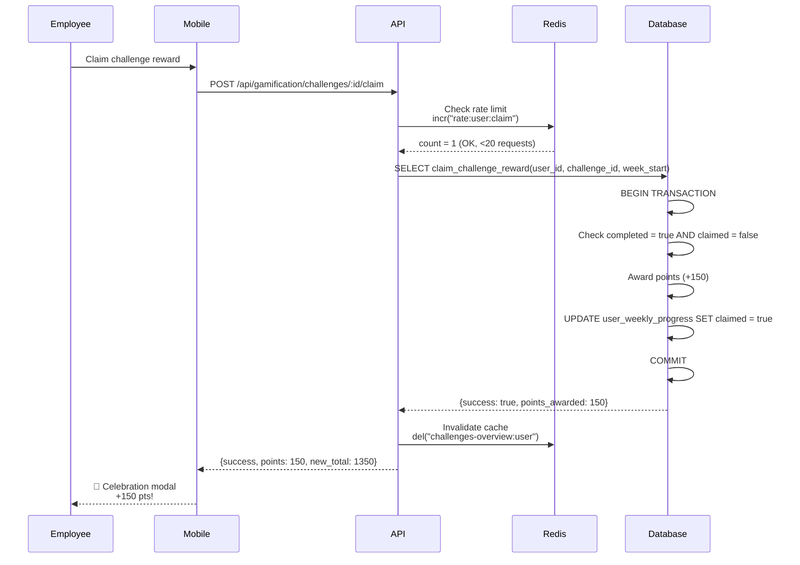

---

## 🔐 Sécurité Multi-Tenant

### Row Level Security (RLS) Architecture

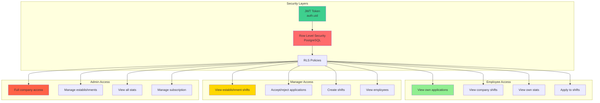

---

### Multi-Tenant Data Isolation

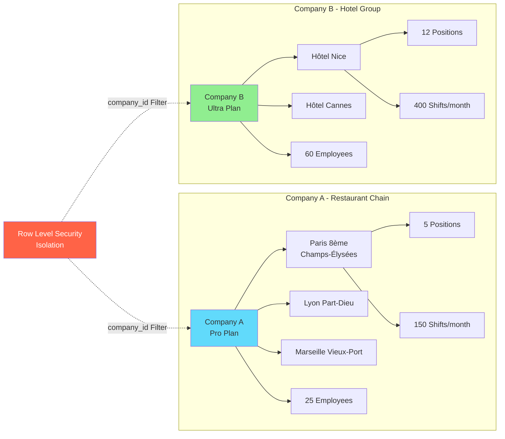

---

## 🚀 Déploiement

### Infrastructure Overview

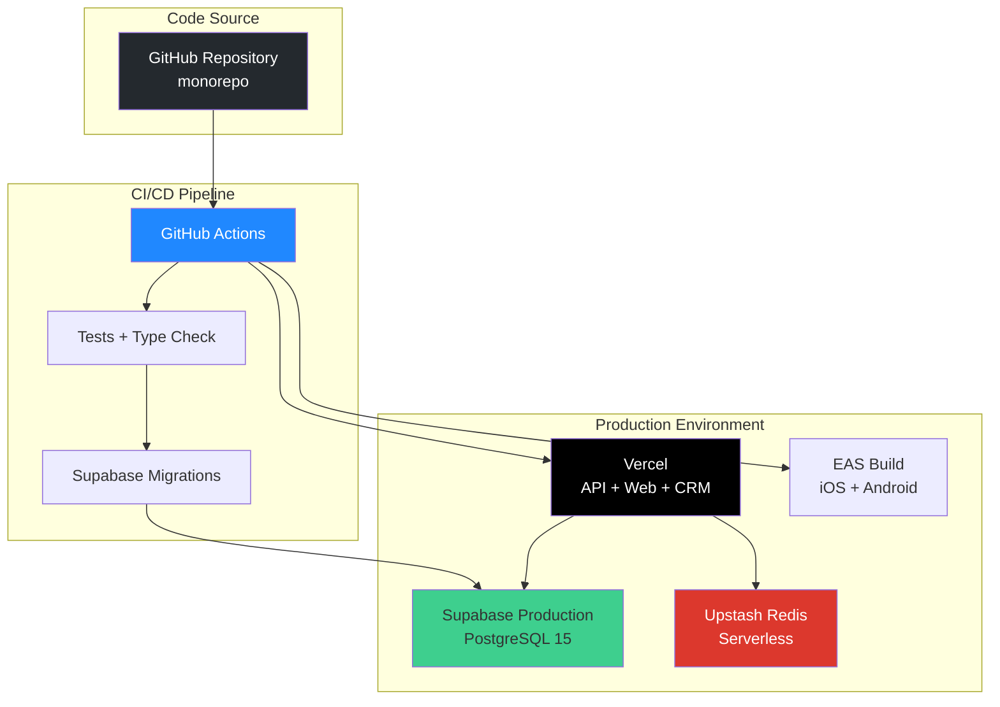

---

### Deployment Workflow

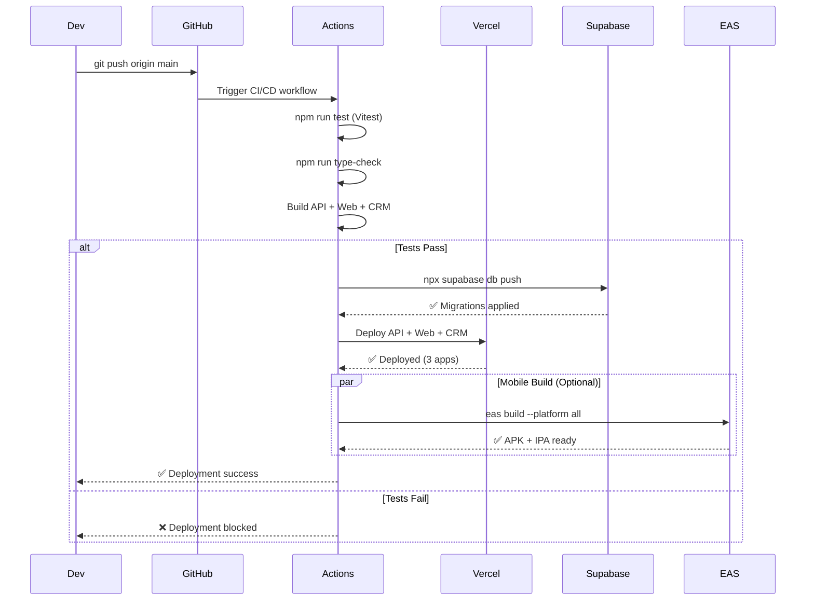

---

## 📈 Scalabilité

### Horizontal Scaling Strategy

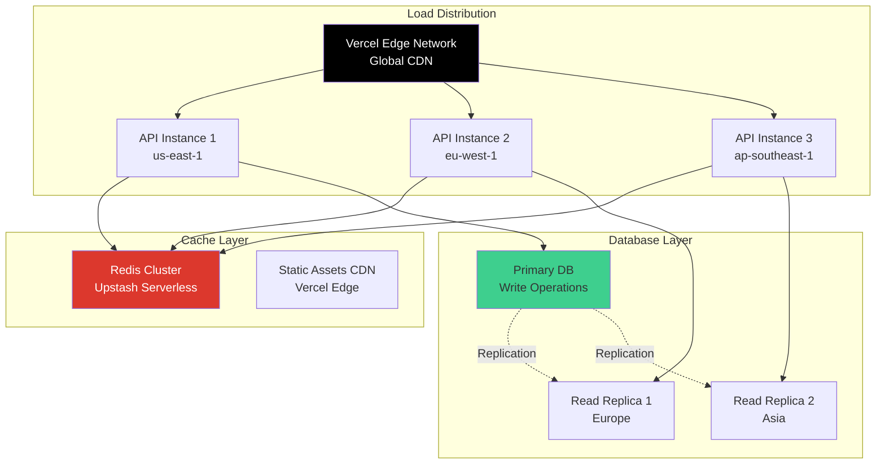

---

### Performance Bottlenecks & Solutions

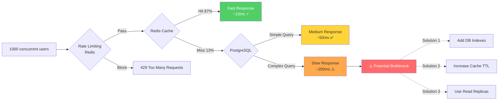

---

### Cache Strategy

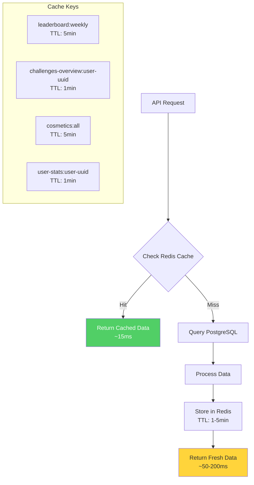

---

## 🔗 Services Externes

### Integrations Architecture

```mermaid
graph TB
    App[Shift Express API]

    App --> Stripe[Stripe<br/>Payments & Subscriptions]
    App --> Expo[Expo Push Notifications<br/>Mobile]
    App --> Resend[Resend<br/>Transactional Emails]
    App --> Sentry[Sentry<br/>Error Tracking]

    Stripe -.Webhooks.-> App
    Supabase -.Webhooks.-> App

    subgraph "Webhook Handlers"
        W1[/api/stripe/webhook<br/>invoice.paid]
        W2[/api/stripe/webhook<br/>subscription.updated]
        W3[/api/supabase/webhook<br/>user.created]
    end

    style Stripe fill:#635bff,color:#fff
    style Expo fill:#000020,color:#fff
    style Resend fill:#000000,color:#fff
    style Sentry fill:#362d59,color:#fff
```

---

## 📊 Monitoring & Observability

### Observability Stack

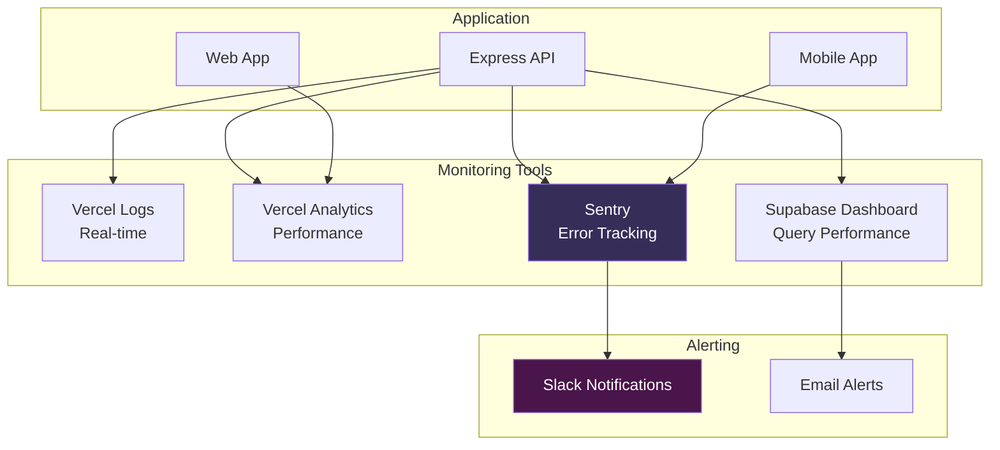

---

## 📚 Références

- [ADRs](./adr/README.md) - Architecture Decision Records
- [Database Schema](./DATABASE.md) - Schéma détaillé 27 tables
- [API Documentation](./API.md) - 20 endpoints documentés
- [Gamification System](./GAMIFICATION_SYSTEM.md) - Weekly challenges + Cosmetics
- [Troubleshooting](./TROUBLESHOOTING.md) - Guide de debugging

---

**Version**: 2.0.0
**Dernière mise à jour**: 2025-10-17
**Prochaine review**: Trimestrielle
