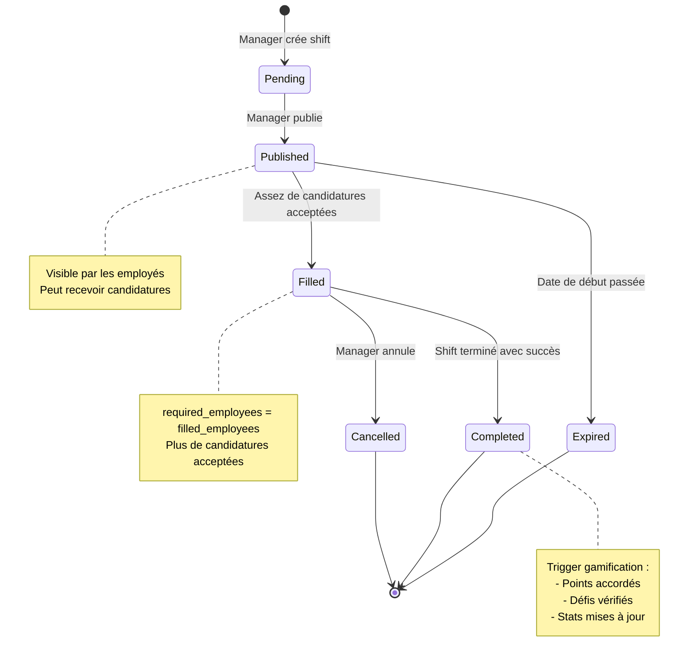
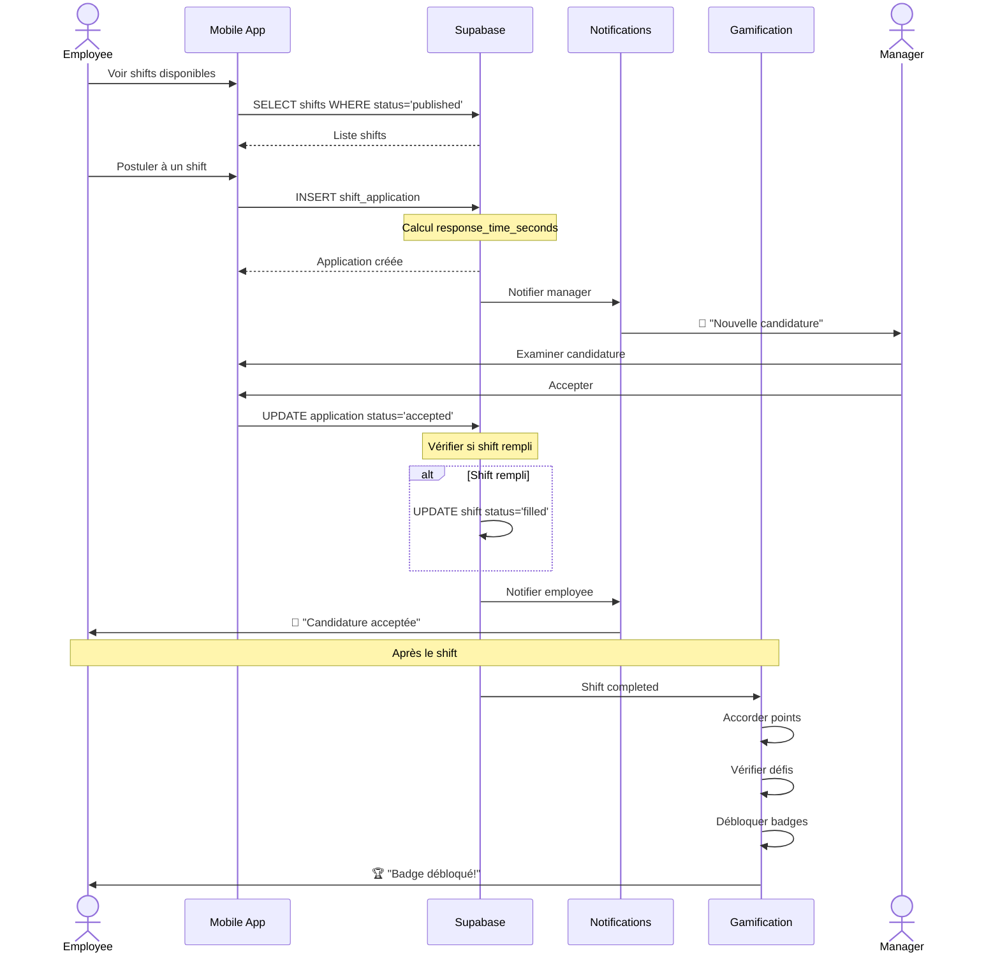
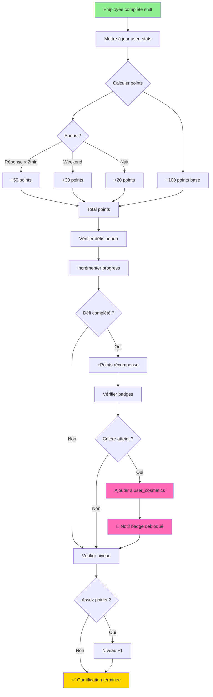
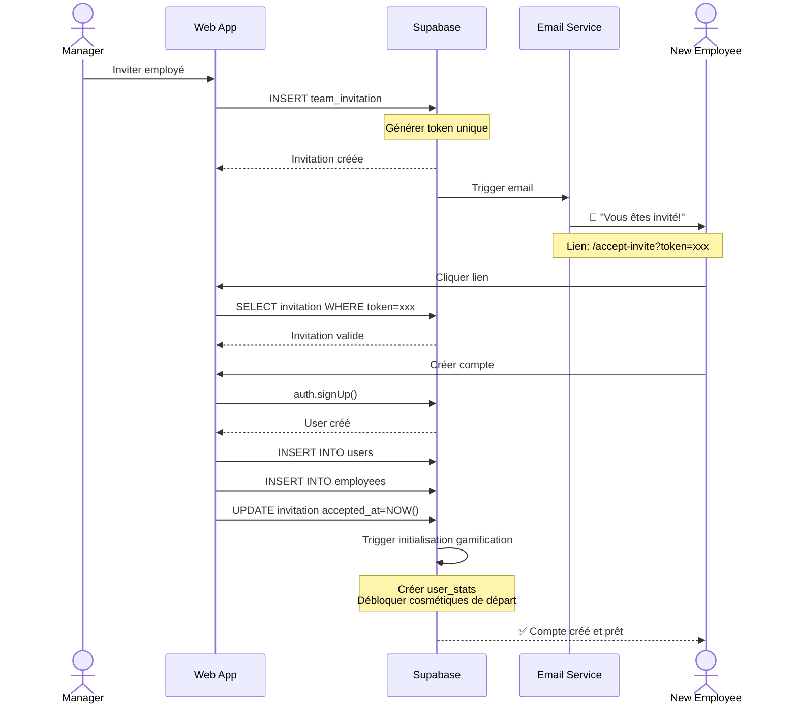
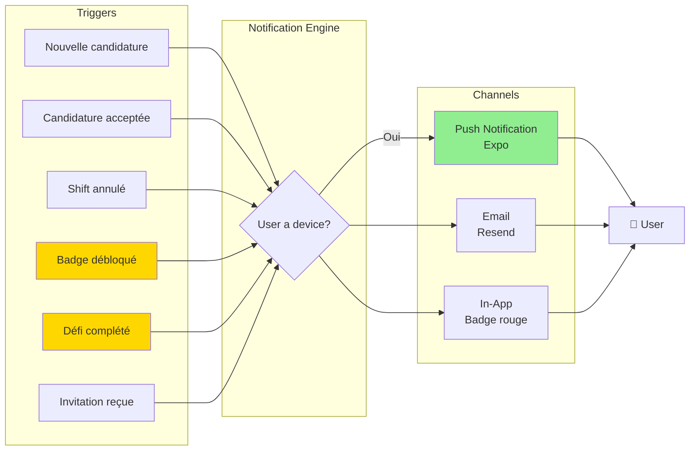
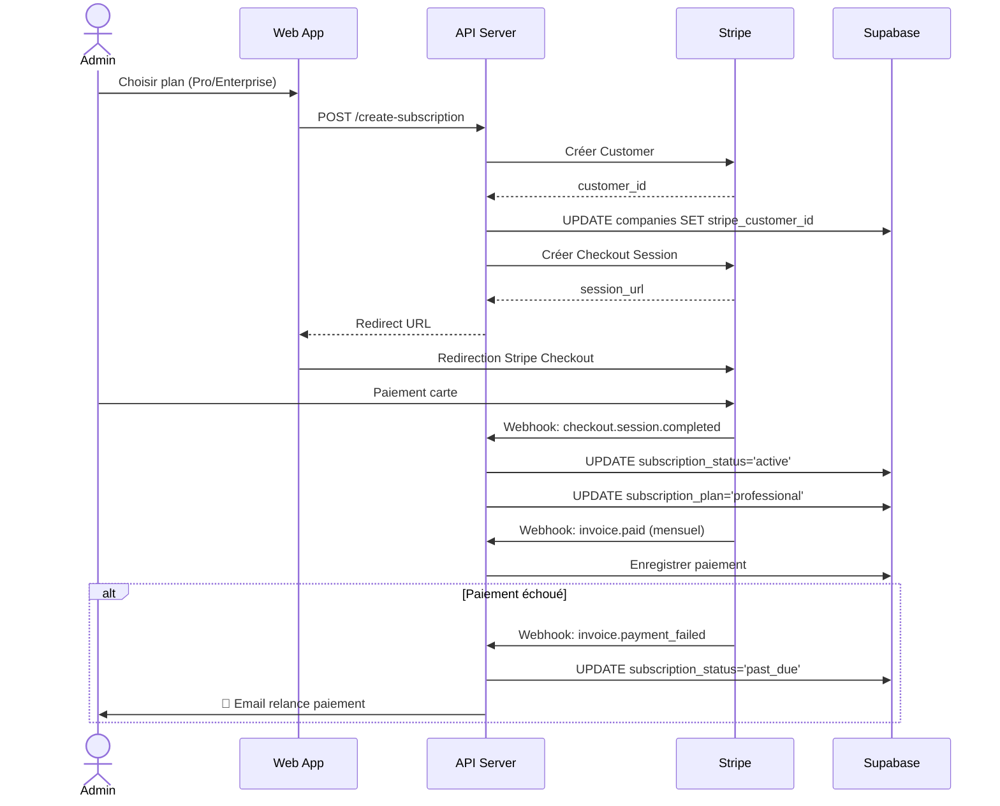
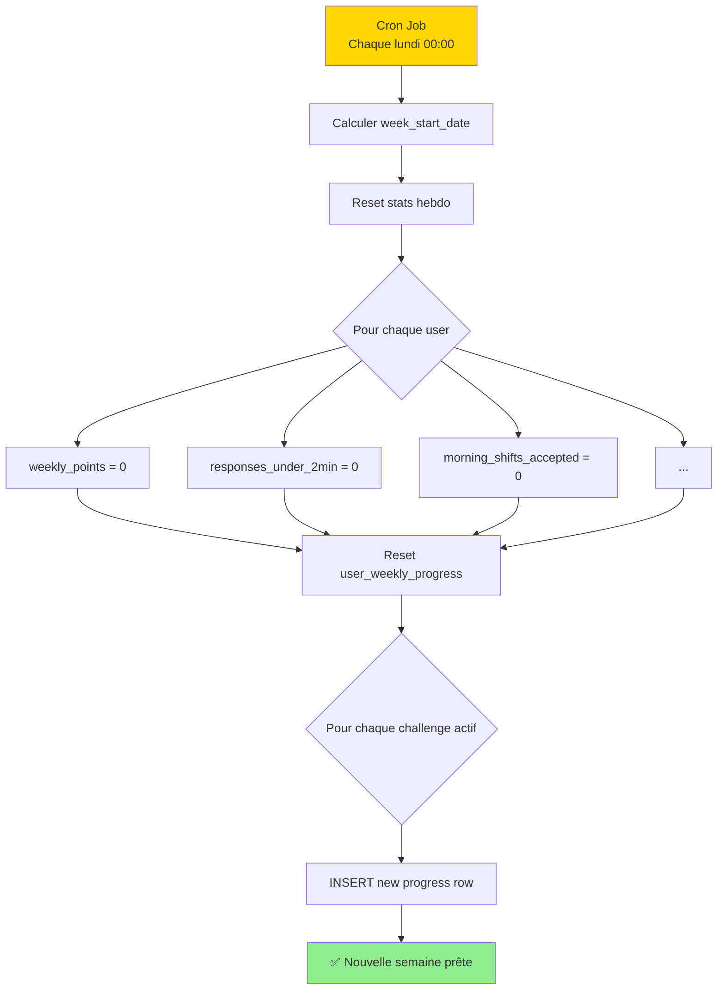

# 🔄 Flows Métier - Shift Express

## 📋 Cycle de Vie d'un Shift

## 🙋 Flow de Candidature à un Shift

## 🎮 Système de Gamification

## 📧 Flow d'Invitation Employé

## 🔔 Système de Notifications

## 💳 Flow de Souscription (Stripe)

## 🔄 Reset Hebdomadaire des Défis

## 🚨 Gestion No-Show

---

**Note :** Ces diagrammes sont en Mermaid et s'affichent automatiquement sur GitHub !
