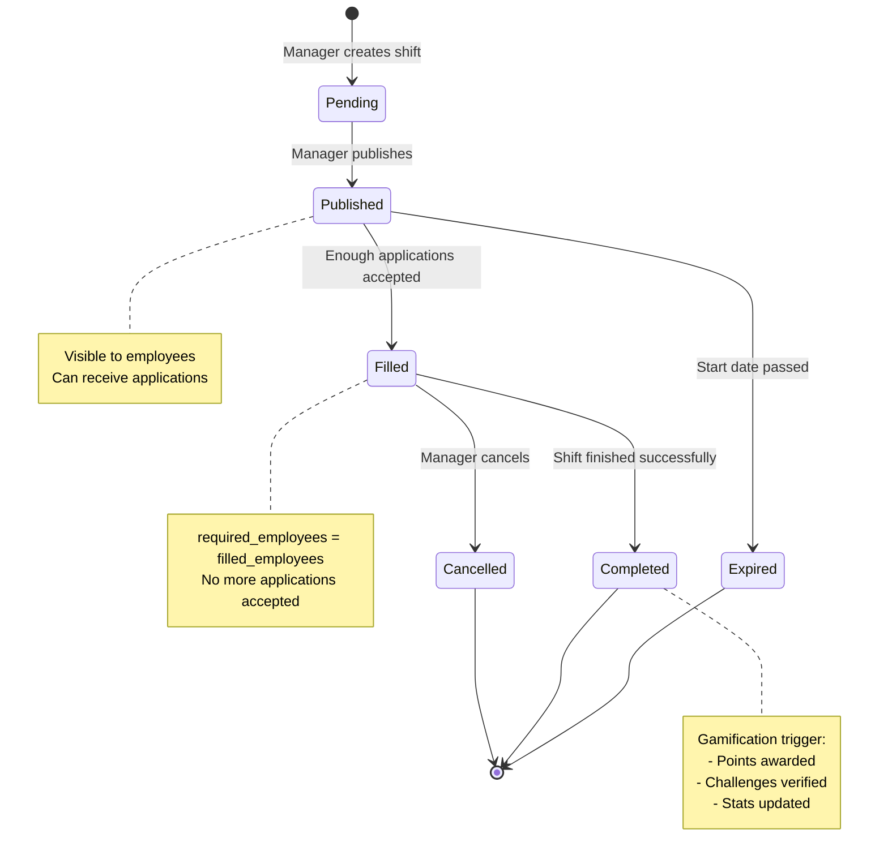
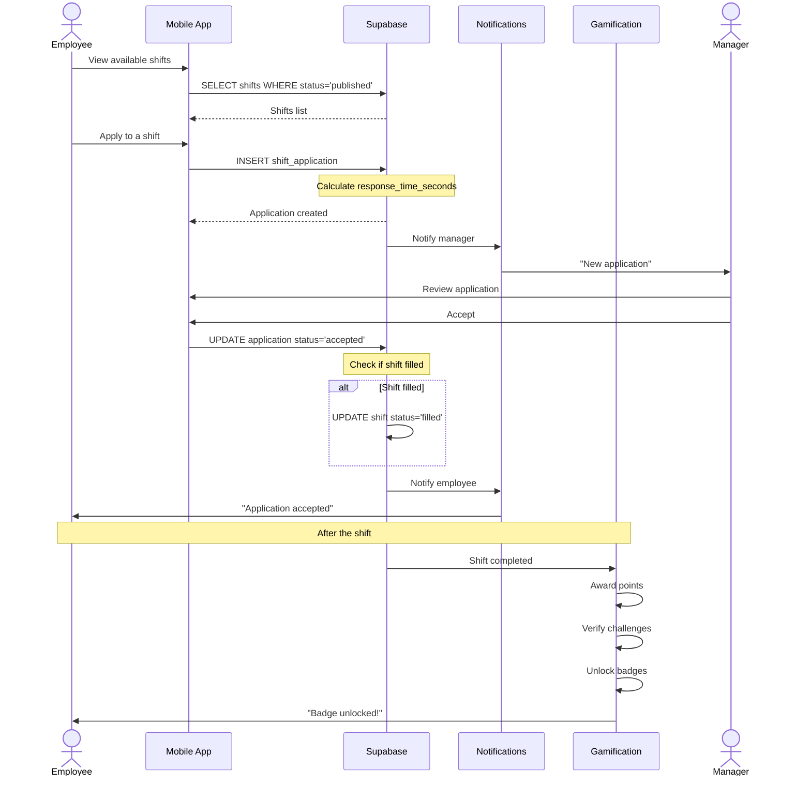
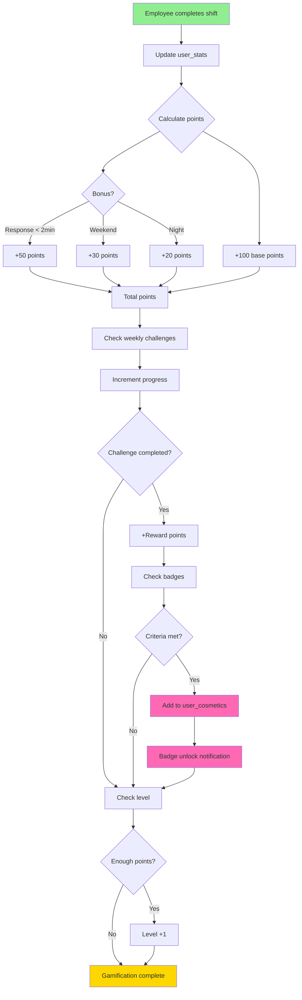
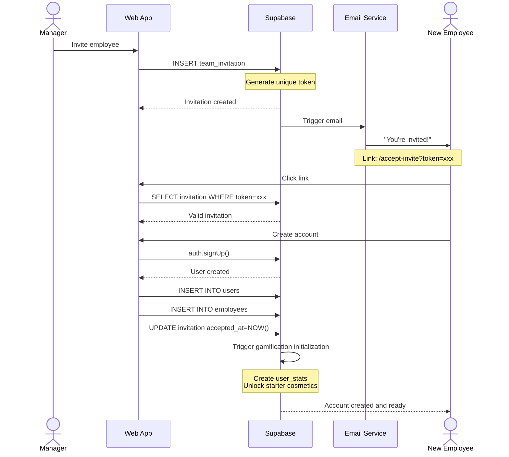
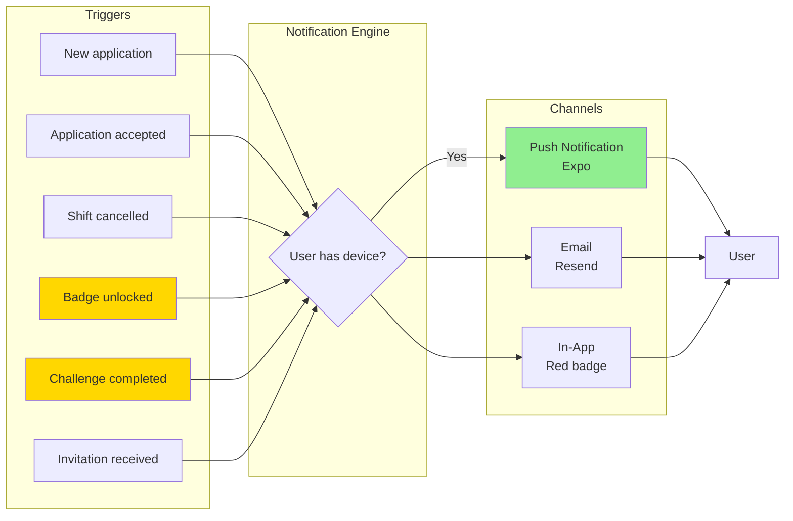
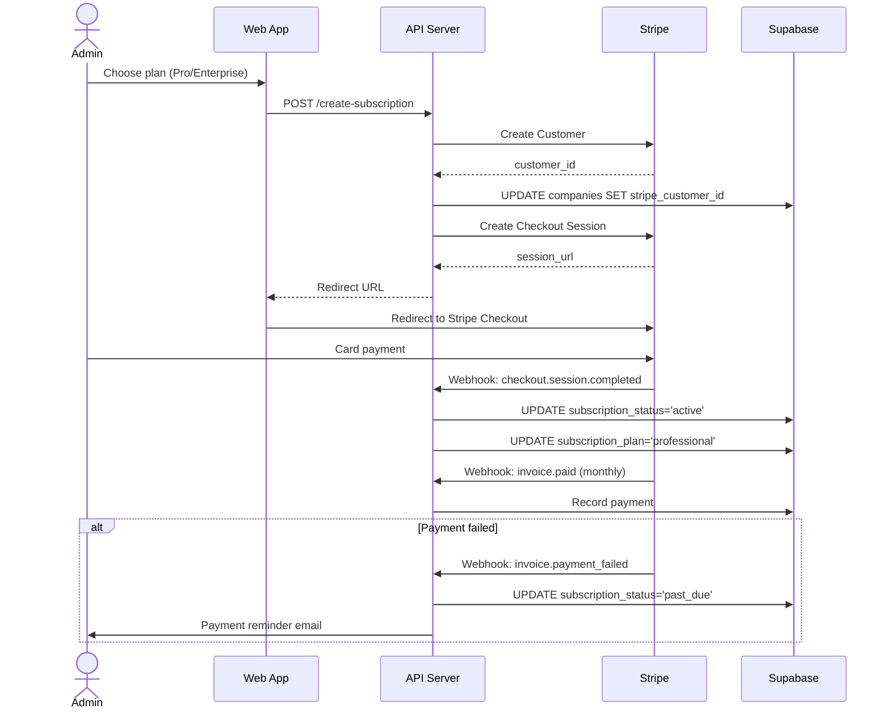
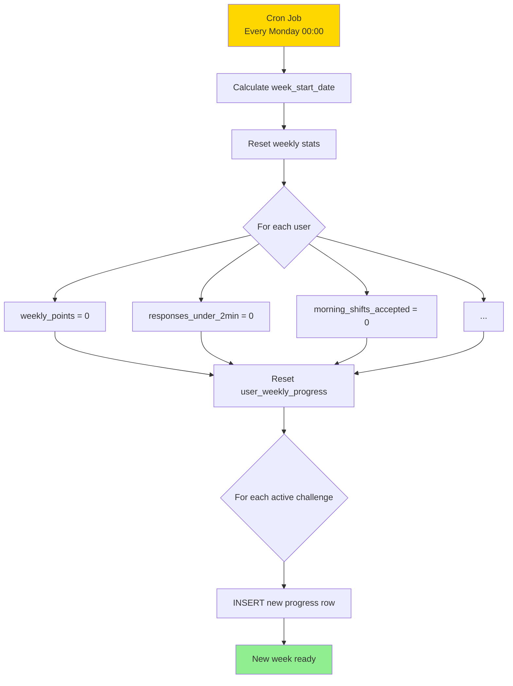
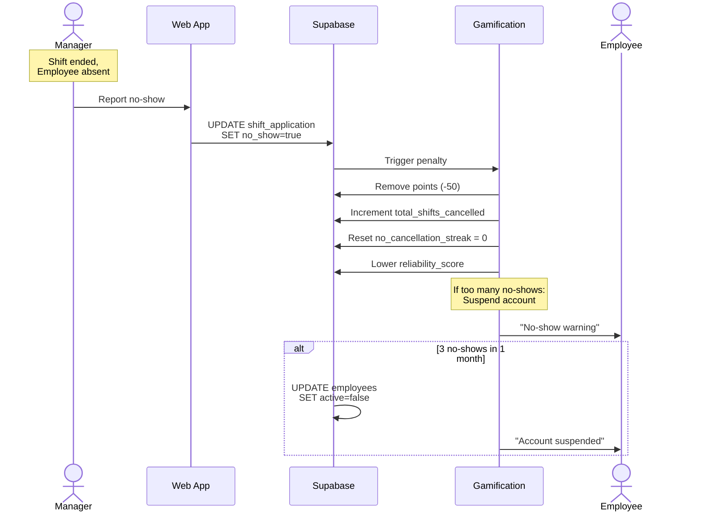

# Business Flows - Shift Express

## Shift Lifecycle

## Shift Application Flow

## Gamification System

## Employee Invitation Flow

## Notification System

## Subscription Flow (Stripe)

## Weekly Challenge Reset

## No-Show Management

---

**Note:** These diagrams are in Mermaid format and render automatically on GitHub!
